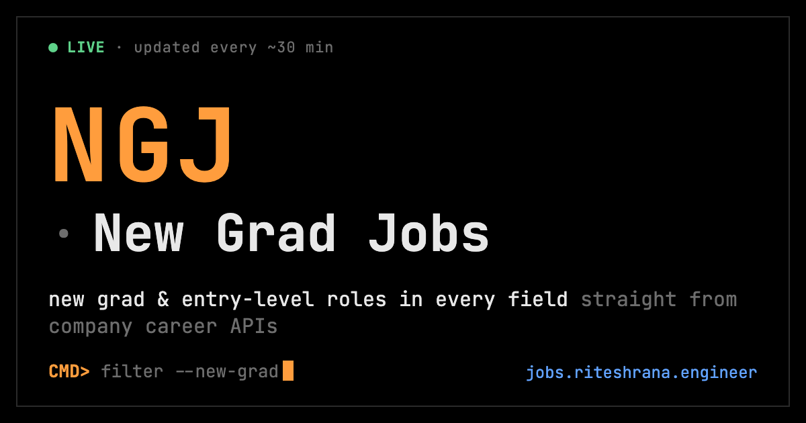

# 2026 New Grad Positions

**Fully automated** list of entry-level positions for 2025–2027 new graduates: software, data, engineering, finance, marketing, sales, healthcare and every other field, pulled straight from company career sites.

Unlike manually curated lists, this repository pulls directly from configured company APIs and refreshes **about every 30 minutes**, 24/7.

**[Open the live board →](https://jobs.riteshrana.engineer/)** · [Browse by role, company, city](https://jobs.riteshrana.engineer/jobs/) · [Guides](https://jobs.riteshrana.engineer/guides/) · [RSS alerts](https://jobs.riteshrana.engineer/feed.xml) · [How it works](https://jobs.riteshrana.engineer/about/)

**Contribute** by submitting an [issue](https://github.com/ambicuity/New-Grad-Jobs/issues/new/choose). See the [contribution guidelines](CONTRIBUTING.md) to get started.

> [!NOTE]
> **Solo-Maintained Project.** This repository is maintained by one person in spare time.
> PRs are reviewed within **1–2 weeks**. Bug fixes take priority over feature requests.
> Before opening an issue, read [SUPPORT.md](.github/SUPPORT.md).

---

## **Website & Autofill Extension**

Explore Zapply’s website and check out:
- Our Chrome extension, which autofills job applications in seconds.
- A dedicated job board featuring the latest openings across various roles.
- User accounts with multiple profiles for different resume types and roles.
- Job application tracking with streaks and commitment awards.

Experience an advanced career journey with us! 🚀

Sponsored by Zapply

---

## Sponsored by [Tailr](https://www.tailr.uk)

**[Tailr](https://www.tailr.uk) rewrites your résumé for each job posting and shows you the ATS match score** — so you stop getting auto-filtered by the same generic résumé. Free 10/day, no card required. This project is proudly sponsored by Tailr.

---

<!-- COUNTS:START - counts below are auto-synced from the scraper output jobs.json by scripts/sync_readme_counts.py -->
## Browse <!-- COUNT:total -->2975<!-- /COUNT --> Jobs by Category

| Category | Open Roles |
|----------|-----------:|
| [Software Engineering](#software-engineering) | <!-- COUNT:software_engineering -->1048<!-- /COUNT --> |
| [Frontend Engineering](#frontend-engineering) | <!-- COUNT:frontend -->14<!-- /COUNT --> |
| [Backend Engineering](#backend-engineering) | <!-- COUNT:backend -->17<!-- /COUNT --> |
| [Mobile Engineering](#mobile-engineering) | <!-- COUNT:mobile -->7<!-- /COUNT --> |
| [Security Engineering](#security-engineering) | <!-- COUNT:security -->91<!-- /COUNT --> |
| [Data Science & ML](#data-science--ml) | <!-- COUNT:data_ml -->138<!-- /COUNT --> |
| [Data Engineering](#data-engineering) | <!-- COUNT:data_engineering -->32<!-- /COUNT --> |
| [Data Analyst](#data-analyst) | <!-- COUNT:data_analyst -->8<!-- /COUNT --> |
| [Infrastructure & SRE](#infrastructure--sre) | <!-- COUNT:infrastructure_sre -->192<!-- /COUNT --> |
| [Product Management](#product-management) | <!-- COUNT:product_management -->4<!-- /COUNT --> |
| [Project Management](#project-management) | <!-- COUNT:project_management -->19<!-- /COUNT --> |
| [Quantitative Finance](#quantitative-finance) | <!-- COUNT:quant_finance -->16<!-- /COUNT --> |
| [Hardware Engineering](#hardware-engineering) | <!-- COUNT:hardware -->78<!-- /COUNT --> |
| [Engineering and Development](#engineering-and-development) | <!-- COUNT:engineering -->311<!-- /COUNT --> |
| [Creatives and Design](#creatives-and-design) | <!-- COUNT:design -->23<!-- /COUNT --> |
| [Business Analyst](#business-analyst) | <!-- COUNT:business_analyst -->83<!-- /COUNT --> |
| [Marketing](#marketing) | <!-- COUNT:marketing -->21<!-- /COUNT --> |
| [Sales](#sales) | <!-- COUNT:sales -->127<!-- /COUNT --> |
| [Accounting and Finance](#accounting-and-finance) | <!-- COUNT:accounting_finance -->166<!-- /COUNT --> |
| [Consulting](#consulting) | <!-- COUNT:consulting -->53<!-- /COUNT --> |
| [Human Resources](#human-resources) | <!-- COUNT:human_resources -->63<!-- /COUNT --> |
| [Legal and Compliance](#legal-and-compliance) | <!-- COUNT:legal -->33<!-- /COUNT --> |
| [Customer Service and Support](#customer-service-and-support) | <!-- COUNT:customer_support -->67<!-- /COUNT --> |
| [Supply Chain](#supply-chain) | <!-- COUNT:supply_chain -->100<!-- /COUNT --> |
| [Healthcare](#healthcare) | <!-- COUNT:healthcare -->119<!-- /COUNT --> |
| [Education and Training](#education-and-training) | <!-- COUNT:education -->5<!-- /COUNT --> |
| [Public Sector and Government](#public-sector-and-government) | <!-- COUNT:public_sector -->3<!-- /COUNT --> |
| [Arts and Entertainment](#arts-and-entertainment) | <!-- COUNT:arts_entertainment -->4<!-- /COUNT --> |
| [Management and Executive](#management-and-executive) | <!-- COUNT:management -->58<!-- /COUNT --> |
| [Other](#other) | <!-- COUNT:other -->75<!-- /COUNT --> |
<!-- COUNTS:END -->

---

<!-- CATEGORY-LISTINGS:START - auto-generated from the scraper output jobs.json by scripts/sync_readme_jobs.py; do not edit by hand -->

> **Live listings** — the 10 most recently posted roles per category, refreshed about every 30 minutes. Browse and filter all **2,975** live roles on the **[live job board](https://jobs.riteshrana.engineer/)**.

## Software Engineering

[Back to top](#2026-new-grad-positions)

| Company | Role | Location | Posted | Apply |
|---------|------|----------|--------|-------|
| SpaceX | Software Engineer \(Starlink Ground Network\) | Redmond, WA | Today | [Apply](<https://boards.greenhouse.io/spacex/jobs/8841324002?gh_jid=8841324002>) |
| Roblox | Software Engineer, GenAI Platform | San Mateo, CA, United States | Today | [Apply](<https://careers.roblox.com/jobs/8171283?gh_jid=8171283>) |
| Anduril Industries | Systems Engineer, Space Emerging Talent | Costa Mesa, California, United States | Today | [Apply](<https://boards.greenhouse.io/andurilindustries/jobs/5236296007?gh_jid=5236296007>) |
| Instacart | Software Engineer II, Advertiser Optimization | Canada - Remote \(ON, AB, BC, or NS Only\) | Today | [Apply](<https://instacart.careers/job/?gh_jid=8233716>) |
| Contentful | Software Engineer, Applied AI Solutions | Denver, Colorado, United States | Today | [Apply](<https://job-boards.greenhouse.io/contentful/jobs/8233486>) |
| CoreWeave | GPU Performance Software Engineer | New York, NY | Today | [Apply](<https://coreweave.com/careers/job?4703438006&board=coreweave&gh_jid=4703438006>) |
| Braze | Software Engineer II, Data Lakehouse | Toronto | Today | [Apply](<https://job-boards.greenhouse.io/braze/jobs/8222294>) |
| Adyen | Software Engineer II \(Kotlin\) - Core Experience | Chicago | Today | [Apply](<https://job-boards.greenhouse.io/adyen/jobs/8210671>) |
| Palantir | Software Engineer – Query Engines | New York, NY | Today | [Apply](<https://jobs.lever.co/palantir/a576c5ef-2a51-4522-9c98-bca5ac2abbb3>) |
| Cloudflare | Hardware Systems Engineer | In-Office | Today | [Apply](<https://boards.greenhouse.io/cloudflare/jobs/8223480?gh_jid=8223480>) |

**[View all 1,048 Software Engineering roles on the live board](https://jobs.riteshrana.engineer/)**

## Frontend Engineering

[Back to top](#2026-new-grad-positions)

| Company | Role | Location | Posted | Apply |
|---------|------|----------|--------|-------|
| Ramp | Software Engineer, Frontend, Growth | New York City, NY, USA | 3 days ago | [Apply](<https://jobs.ashbyhq.com/ramp/7cd46077-05fe-4cd7-816f-5528638342f1>) |
| Reddit | Front End Software Engineer, Consumer Engineering | Remote - United States | 2026-09-17 | [Apply](<https://job-boards.greenhouse.io/reddit/jobs/8147559>) |
| CACI | Front-end Software Developer | Aberdeen Proving Ground, MD, US | 2026-09-16 | [Apply](<https://caci.wd1.myworkdayjobs.com/job/Aberdeen-Proving-Ground-MD-US/Front-end-Software-Developer_331152>) |
| Accenture | Junior Frontend Developer \(all genders\) | — | 2026-09-14 | [Apply](<https://accenture.wd103.myworkdayjobs.com/job/Kronberg-Building-Beta/Junior-Frontend-Developer--all-genders-_R00354171>) |
| Booz Allen Hamilton | Front End Software Engineer | Chantilly, VA | 2026-09-14 | [Apply](<https://bah.wd1.myworkdayjobs.com/job/Chantilly-VA/Front-End-Software-Engineer_R0249441>) |
| Reddit | Front End Software Engineer, Media Player | Remote - United States | 2026-09-11 | [Apply](<https://job-boards.greenhouse.io/reddit/jobs/8198102>) |
| Affirm | Software Engineer I, Frontend \(Upfunnel\) | Remote Canada | 2026-09-11 | [Apply](<https://job-boards.greenhouse.io/affirm/jobs/7985907003>) |
| Accenture | Web Developer Associate | — | 2026-08-26 | [Apply](<https://accenture.wd103.myworkdayjobs.com/job/Mumbai/Web-Developer-Associate_AIOC-S01652221>) |
| CACI | Front-end Software Developer | Denver, CO, US | 2026-08-26 | [Apply](<https://caci.wd1.myworkdayjobs.com/job/Denver-CO-US/Front-end-Software-Developer_329940>) |
| Booz Allen Hamilton | Front-End Software Engineer | Chantilly, VA | 2026-08-26 | [Apply](<https://bah.wd1.myworkdayjobs.com/job/Chantilly-VA/Front-End-Software-Engineer_R0245772>) |

**[View all 14 Frontend Engineering roles on the live board](https://jobs.riteshrana.engineer/)**

## Backend Engineering

[Back to top](#2026-new-grad-positions)

| Company | Role | Location | Posted | Apply |
|---------|------|----------|--------|-------|
| SpaceX | Software Engineer, Backend \(Python/C++\) | Hawthorne, CA | Today | [Apply](<https://boards.greenhouse.io/spacex/jobs/8845089002?gh_jid=8845089002>) |
| Affirm | Software Engineer II, Backend \(Identity Decisioning\) | Remote Canada | 1 day ago | [Apply](<https://job-boards.greenhouse.io/affirm/jobs/7985862003>) |
| Affirm | Software Engineer II, Backend \(Identity Decisioning\) | Remote US | 1 day ago | [Apply](<https://job-boards.greenhouse.io/affirm/jobs/7985860003>) |
| Xero | Associate Engineer \(Back End\) | Calgary, AB, CA | 2 days ago | [Apply](<https://ca.indeed.com/viewjob?jk=ef35619bf16c22ce>) |
| Lyft | Backend Software Engineer, Airports | San Francisco, CA | 6 days ago | [Apply](<https://app.careerpuck.com/job-board/lyft/job/8806570002?gh_jid=8806570002>) |
| Brex | Software Engineer II, Backend | Vancouver, British Columbia, Canada | 2026-09-16 | [Apply](<https://www.brex.com/careers/8815512002?gh_jid=8815512002>) |
| Brex | Software Engineer II, Backend | New York, New York, United States | 2026-09-16 | [Apply](<https://www.brex.com/careers/8815443002?gh_jid=8815443002>) |
| Brex | Software Engineer II, Backend | San Francisco, California, United States | 2026-09-16 | [Apply](<https://www.brex.com/careers/8815438002?gh_jid=8815438002>) |
| Stripe | Software Engineer, Backend | Seattle, WA | 2026-09-14 | [Apply](<https://stripe.com/jobs/search?gh_jid=8198280>) |
| OpenAI | Backend Software Engineer, ChatGPT ImageGen | San Francisco, California, United States | 2026-09-11 | [Apply](<https://jobs.ashbyhq.com/openai/e7a4ee23-138a-4004-916e-72a452e7d115>) |

**[View all 17 Backend Engineering roles on the live board](https://jobs.riteshrana.engineer/)**

## Mobile Engineering

[Back to top](#2026-new-grad-positions)

| Company | Role | Location | Posted | Apply |
|---------|------|----------|--------|-------|
| BJAK | iOS Software Engineer | United States, United States, United States | Today | [Apply](<https://jobs.ashbyhq.com/bjakcareer/b22150b6-5fa7-4842-b501-e5322f2f75b3>) |
| BJAK | Android Software Engineer | United States, United States, United States | Today | [Apply](<https://jobs.ashbyhq.com/bjakcareer/c4272eb4-56fc-4f3e-8d5a-cc14c7e7c4ef>) |
| BJAK | Android Software Engineer - AI Neobank App | India, India, India | 2026-09-01 | [Apply](<https://jobs.ashbyhq.com/bjakcareer/82349fdc-fc80-4da1-a39e-1f70dee09ba5>) |
| BJAK | Android Software Engineer - AI Neobank App | United States, United States, United States | 2026-09-01 | [Apply](<https://jobs.ashbyhq.com/bjakcareer/6cd46335-dae2-40e1-807a-b8f2dc18f618>) |
| Lyft | Android Software Engineer, Lyft Urban Solutions | Montreal, Canada | 2026-08-28 | [Apply](<https://app.careerpuck.com/job-board/lyft/job/8743513002?gh_jid=8743513002>) |
| StockX | Software Engineer - iOS | Bangalore, India | 2026-08-25 | [Apply](<https://job-boards.greenhouse.io/stockx/jobs/8742590002>) |
| OpenAI | Android Systems Engineer, Consumer Devices | San Francisco, California, United States | 2026-08-21 | [Apply](<https://jobs.ashbyhq.com/openai/b08126cc-8134-45f0-aeb3-4b00e96547de>) |

## Security Engineering

[Back to top](#2026-new-grad-positions)

| Company | Role | Location | Posted | Apply |
|---------|------|----------|--------|-------|
| Stripe | Offensive Security Engineer | US - Remote | Today | [Apply](<https://stripe.com/jobs/search?gh_jid=8233889>) |
| SpaceX | Security Engineer \(Vulnerability Management\) | Starbase, TX | Today | [Apply](<https://boards.greenhouse.io/spacex/jobs/8843974002?gh_jid=8843974002>) |
| W2 Communications | Account Associate - Cyber Security PR | McLean, VA, US | Today | [Apply](<https://www.indeed.com/viewjob?jk=2e4dfda011b2168e>) |
| Mass General Brigham | Information Security Analyst I - Automation | Somerville, MA, US | Today | [Apply](<https://www.indeed.com/viewjob?jk=4dee6d38ca9a4693>) |
| Leidos | Junior Security Engineer | Bethesda, MD | Today | [Apply](<https://leidos.wd5.myworkdayjobs.com/job/Bethesda-MD/Junior-Security-Engineer_R-00192204>) |
| Spotify | Security Engineer - Detection and Response | New York, NY | 1 day ago | [Apply](<https://jobs.lever.co/spotify/cb29d857-395b-401d-9749-367e666ff870>) |
| Wiz | Security Engineer, Product &amp; Production Infrastructure | Remote - USA | 1 day ago | [Apply](<https://www.wiz.io/careers/job/4711762006/:title?gh_jid=4711762006>) |
| Northrop Grumman | 2026 Associate Cybersecurity Analyst - Pathways Program - Rocket Center WV | United States-West Virginia-Rocket Center | 1 day ago | [Apply](<https://ngc.wd1.myworkdayjobs.com/job/United-States-West-Virginia-Rocket-Center/XMLNAME-2026-Associate-Cybersecurity-Analyst---Pathways-Program---Rocket-Center-WV_R10252865>) |
| Raytheon | Systems Security Engineer I – Anti-Tamper / Program Protection \(Onsite-Tucson, AZ\) – P1 | US-AZ-TUCSON-801 ~ 1151 E Hermans Rd ~ BLDG 801 \(External Site\) | 1 day ago | [Apply](<https://globalhr.wd5.myworkdayjobs.com/job/US-AZ-TUCSON-801--1151-E-Hermans-Rd--BLDG-801-External-Site/Systems-Security-Engineer-I---Anti-Tamper---Program-Protection--Onsite-Tucson--AZ----P1_01873154>) |
| Booz Allen Hamilton | Cyber Technical Specialist, Junior | Suffolk, VA | 1 day ago | [Apply](<https://bah.wd1.myworkdayjobs.com/job/Suffolk-VA/Cyber-Technical-Specialist--Junior_R0249897>) |

**[View all 91 Security Engineering roles on the live board](https://jobs.riteshrana.engineer/)**

## Data Science & ML

[Back to top](#2026-new-grad-positions)

| Company | Role | Location | Posted | Apply |
|---------|------|----------|--------|-------|
| Glean | Machine Learning Engineer, Search Quality | San Francisco, CA | Today | [Apply](<https://job-boards.greenhouse.io/gleanwork/jobs/4738120005>) |
| Johns Hopkins University Applied Physics Laboratory | 2027 BS/MS Graduate - Neural Engineer | Laurel, MD, US | Today | [Apply](<https://www.indeed.com/viewjob?jk=50a927dc32a881d3>) |
| Mortenson Construction | Data Scientist | Minneapolis, MN, US | Today | [Apply](<https://www.indeed.com/viewjob?jk=e2e6473039853814>) |
| Atlassian | Machine Learning Engineer, 2027 Graduate U.S. | Seattle, WA, US | Today | [Apply](<https://www.indeed.com/viewjob?jk=8234c1723251ec41>) |
| The University of Michigan | Professor / Associate Professor in Human-Centered Embodied Artificial Intelligence \(Robotics\) | Ann Arbor, MI, US | Today | [Apply](<https://www.indeed.com/viewjob?jk=89fc3ab0ebc5391b>) |
| Citi | Machine learning and GEN AI Data Scientist | Gurugram Haryana India | Today | [Apply](<https://citi.wd5.myworkdayjobs.com/job/Gurugram-Haryana-India/Machine-learning-and-GEN-AI-Data-Scientist_26993429>) |
| Unknown | Data Scientist | Minneapolis, MN, US | Today | [Apply](<https://www.indeed.com/viewjob?jk=7d29a2300f5c512d>) |
| Mastercard | Field Data Scientist | Toronto, Canada | Today | [Apply](<https://mastercard.wd1.myworkdayjobs.com/job/Toronto-Canada/Field-Data-Scientist_R-291566>) |
| Accenture | Junior GenAI Engineer \(AI&amp;Data\) | — | Today | [Apply](<https://accenture.wd103.myworkdayjobs.com/job/Warsaw-Sienna-39/Junior-GenAI---Conversational-Analytics-Engineer--AI-Data-_R00318994>) |
| Accenture | Junior Applied AI Engineer \(all genders\) | — | Today | [Apply](<https://accenture.wd103.myworkdayjobs.com/job/Kronberg-Campus-Kronberg-1/AI-Native-Software-Engineering--Junior-_R00345665>) |

**[View all 138 Data Science & ML roles on the live board](https://jobs.riteshrana.engineer/)**

## Data Engineering

[Back to top](#2026-new-grad-positions)

| Company | Role | Location | Posted | Apply |
|---------|------|----------|--------|-------|
| Bridgenext | Data Engineer \(Databricks\) | MH, IN | Today | [Apply](<https://in.indeed.com/viewjob?jk=8f5c862cc8acf950>) |
| AppLovin | ML Data Infrastructure Engineer | Palo Alto, CA | Today | [Apply](<https://boards.greenhouse.io/applovin/jobs/4716524006?gh_jid=4716524006>) |
| RBC | 2027 CFO, Winter Data Engineer \(8 months\) | Toronto, ON, CA | 1 day ago | [Apply](<https://ca.indeed.com/viewjob?jk=41b3c534dddbce2f>) |
| Accenture | Data Engineer | — | 2 days ago | [Apply](<https://accenture.wd103.myworkdayjobs.com/job/Hyderabad/Data-Engineer_ATCI-5765995-S2068087-1>) |
| Accenture | Data Engineer | — | 2 days ago | [Apply](<https://accenture.wd103.myworkdayjobs.com/job/Hyderabad/Data-Engineer_ATCI-5765994-S2068784-1>) |
| The Walt Disney Company | Software Data Engineer | Burbank, CA, USA | 3 days ago | [Apply](<https://disney.wd5.myworkdayjobs.com/job/Burbank-CA-USA/Software-Data-Engineer_10160911>) |
| General Dynamics | Data Engineer | USA VA Falls Church | 3 days ago | [Apply](<https://gdit.wd5.myworkdayjobs.com/job/USA-VA-Falls-Church/Data-Engineer_RQ225443-1>) |
| Orion Innovation | Azure Data Engineer | Montvale, New Jersey, United States | 4 days ago | [Apply](<https://www.orioninc.com/careers/job/?gh_jid=4714763006>) |
| General Dynamics | NCIS Data Engineer / Active Secret clearance | USA VA Quantico | 5 days ago | [Apply](<https://gdit.wd5.myworkdayjobs.com/job/USA-VA-Quantico/NCIS-Data-Engineer---Active-Secret-clearance_RQ228816-1>) |
| Campfire | Data Engineer | 300 Montgomery St Suite 500 San Francisco, California 94104, United States | 2026-09-18 | [Apply](<https://jobs.ashbyhq.com/campfire/2b30b7a1-3649-40e5-804a-ea07bfc94318>) |

**[View all 32 Data Engineering roles on the live board](https://jobs.riteshrana.engineer/)**

## Data Analyst

[Back to top](#2026-new-grad-positions)

| Company | Role | Location | Posted | Apply |
|---------|------|----------|--------|-------|
| Pride Mobility | Junior Manufacturing Data Analyst | Duryea, PA, US | Today | [Apply](<https://www.indeed.com/viewjob?jk=4bd47e8e6033538a>) |
| adMarketplace | Graduate Data Analyst | New York, NY, US | 1 day ago | [Apply](<https://www.indeed.com/viewjob?jk=ef947638ab6b849b>) |
| Raytheon | Associate Business Intelligence Analyst\(AI/ML,Generative AI &amp; Python,1-3 years,Bangalore\) | IN-KA-BENGALURU-NORTHGATE ~ Sy No 2/2 Venkatala Village ~ SY NO 2/2 VENKATALA VILLAGE, Yelahanka Hobli | 1 day ago | [Apply](<https://globalhr.wd5.myworkdayjobs.com/job/IN-KA-BENGALURU-NORTHGATE--Sy-No-22-Venkatala-Village--SY-NO-22-VENKATALA-VILLAGE-Yelahanka-Hobli/Associate-Business-Intelligence-Analyst-AI-ML-Generative-AI---Python-1-3-years-Bangalore-_01876631>) |
| Citi | Research Product Associate - Data Analytics Operations - Officer | Mumbai Maharashtra India | 4 days ago | [Apply](<https://citi.wd5.myworkdayjobs.com/job/Mumbai-Maharashtra-India/Research-Product-Associate---Data-Analytics-Operations---Officer_26992131>) |
| Citi | Research Product Associate - Data Analytics Operations - Officer | Mumbai Maharashtra India | 4 days ago | [Apply](<https://citi.wd5.myworkdayjobs.com/job/Mumbai-Maharashtra-India/Research-Product-Associate---Data-Analytics-Operations---Officer_26992127>) |
| Philips | Full Time- Graduate Development Program-AI &amp; Analytics Associate-Nashville, TN or Cambridge, MA-2027 | Nashville, Tennessee, United States | 2026-09-14 | [Apply](<https://philips.wd3.myworkdayjobs.com/job/Nashville-Tennessee-United-States/Full-Time--Graduate-Development-Program-AI---Analytics-Associate-Nashville--TN-or-Cambridge--MA-2026_587083>) |
| Checkr | Product Data Analyst II | San Francisco, California, United States | 2026-09-11 | [Apply](<https://job-boards.greenhouse.io/checkr/jobs/8188741>) |
| Capital One | Associate, Data Analyst - New Grad, 2027 Start | Toronto, ON | 2026-09-08 | [Apply](<https://capitalone.wd12.myworkdayjobs.com/job/Toronto-ON/Associate--Data-Analyst---New-Grad--2027-Start_R999613-1>) |

## Infrastructure & SRE

[Back to top](#2026-new-grad-positions)

| Company | Role | Location | Posted | Apply |
|---------|------|----------|--------|-------|
| SpaceX | Network Engineer \(Starlink Maritime\) | Redmond, WA | Today | [Apply](<https://boards.greenhouse.io/spacex/jobs/8842743002?gh_jid=8842743002>) |
| SpaceX | Site Reliability Engineer, Kubernetes Platform \(Top Secret Clearance\) | Hawthorne, CA | Today | [Apply](<https://boards.greenhouse.io/spacex/jobs/8843951002?gh_jid=8843951002>) |
| CACI | Network Engineer \(SD-WAN\) | High Point, NC, US | Today | [Apply](<https://caci.wd1.myworkdayjobs.com/job/High-Point-NC-US/Network-Engineer--SD-WAN-_332655>) |
| JPMorganChase | Site Reliability Engineer II - Java/Python, Kubernetes, AWS, Terraform | KA, IN | Today | [Apply](<https://in.indeed.com/viewjob?jk=8e9c8f82ae16fd19>) |
| Advocate Aurora Health | Network Engineer Associate | Milwaukee, WI, US | Today | [Apply](<https://www.indeed.com/viewjob?jk=8995abe9427c57a8>) |
| Skywalk Global | Network Infrastructure Engineer | Jackson, MS, US | Today | [Apply](<https://www.indeed.com/viewjob?jk=9405114508f53a71>) |
| PRADCO | Cloud Infrastructure Engineer | Birmingham, AL, US | Today | [Apply](<https://www.indeed.com/viewjob?jk=5c9009df35d7b57b>) |
| Stella-Jones | Account Specialist I | Brierfield, AL, US | Today | [Apply](<https://www.indeed.com/viewjob?jk=f71763d9e5a513f3>) |
| Leidos | Network Engineer | Bethesda, MD | Today | [Apply](<https://leidos.wd5.myworkdayjobs.com/job/Bethesda-MD/Network-Engineer_R-00192160>) |
| Raytheon | Infrastructure Engineer I \(Onsite\) | US-UT-WEST VALLEY CITY-338 ~ 1127 &amp; 1128 w 2400 S ~ BLDG 338 | Today | [Apply](<https://globalhr.wd5.myworkdayjobs.com/job/US-UT-WEST-VALLEY-CITY-338--1127--1128-w-2400-S--BLDG-338/Software-Engineer-I--Onsite-_01875372>) |

**[View all 192 Infrastructure & SRE roles on the live board](https://jobs.riteshrana.engineer/)**

## Product Management

[Back to top](#2026-new-grad-positions)

| Company | Role | Location | Posted | Apply |
|---------|------|----------|--------|-------|
| The Walt Disney Company | Associate Product Manager \(Project Hire\) | Orlando, FL, USA | 3 days ago | [Apply](<https://disney.wd5.myworkdayjobs.com/job/Orlando-FL-USA/Associate-Product-Manager--Project-Hire-_10159844>) |
| The Home Depot | Associate Product Manager | GLOBAL CUSTOM COMMERCE/BLINDS OFFICE, HOUSTON - 2140 | 2026-09-15 | [Apply](<https://homedepot.wd5.myworkdayjobs.com/job/GLOBAL-CUSTOM-COMMERCEBLINDS-OFFICE-HOUSTON---2140/Associate-Product-Manager_Req193142>) |
| Robinhood | Associate Product Manager \(New Grad\) | New York, NY | 2026-09-14 | [Apply](<https://boards.greenhouse.io/robinhood/jobs/8199973?t=gh_src=&gh_jid=8199973>) |
| Roblox | \[2027\] Associate Product Manager, Early Career | San Mateo, CA, United States | 2026-09-02 | [Apply](<https://careers.roblox.com/jobs/8143976?gh_jid=8143976>) |

## Project Management

[Back to top](#2026-new-grad-positions)

| Company | Role | Location | Posted | Apply |
|---------|------|----------|--------|-------|
| Spectrio LLC | Associate Project Manager | Tampa, FL, US | Today | [Apply](<https://www.indeed.com/viewjob?jk=ae6d5ec1b2514d64>) |
| The Walt Disney Company | COE Associate Project Manager | Burbank, CA, USA | Today | [Apply](<https://disney.wd5.myworkdayjobs.com/job/Burbank-CA-USA/COE-Associate-Project-Manager_10161038>) |
| Western University | Program Coordinator I | London, ON, CA | Today | [Apply](<https://ca.indeed.com/viewjob?jk=3b93aeed1a8fdf2d>) |
| US Farm Service Agency | County Program Analyst/Trainee | Winnemucca, NV, US | Today | [Apply](<https://www.indeed.com/viewjob?jk=98f1dec0421e66f3>) |
| University of California, Santa Barbara | Graduate Program Coordinator | Santa Barbara, CA, US | 1 day ago | [Apply](<https://www.indeed.com/viewjob?jk=5cd02b630cddb182>) |
| The Walt Disney Company | Construction - Associate Project Manager | Lake Buena Vista, FL, USA | 1 day ago | [Apply](<https://disney.wd5.myworkdayjobs.com/job/Lake-Buena-Vista-FL-USA/Construction---Associate-Project-Manager_10161624-1>) |
| Rutgers University | Program Coordinator I | Piscataway, NJ, US | 1 day ago | [Apply](<https://www.indeed.com/viewjob?jk=d52771df75669367>) |
| Booz Allen Hamilton | Project Management Specialist, Junior | Washington, DC | 2 days ago | [Apply](<https://bah.wd1.myworkdayjobs.com/job/Washington-DC/Project-Management-Specialist--Junior_R0249781>) |
| Canadian Nuclear Laboratories | Project Specialist \(New Grad\) | Chalk River, ON, CA | 3 days ago | [Apply](<https://ca.indeed.com/viewjob?jk=0f9d90711129a0d0>) |
| KBR, Inc. | Junior Program Analyst | Lexington Park, Maryland | 2026-09-17 | [Apply](<https://kbr.wd5.myworkdayjobs.com/job/Lexington-Park-Maryland/Junior-Program-Analyst_R2130062>) |

**[View all 19 Project Management roles on the live board](https://jobs.riteshrana.engineer/)**

## Quantitative Finance

[Back to top](#2026-new-grad-positions)

| Company | Role | Location | Posted | Apply |
|---------|------|----------|--------|-------|
| Lactalis | Production Supervisor - Relief \(Available January 4, 2027\) | Winchester, ON, CA | Today | [Apply](<https://ca.indeed.com/viewjob?jk=a5310fab26ea5368>) |
| Rockwood Company | Junior Analyst \(Summer 2027\) | Washington, DC, US | 1 day ago | [Apply](<https://www.indeed.com/viewjob?jk=d6caf78404969a1d>) |
| McMaster University | RESEARCH COORDINATOR \(II\) - JD00439 | Hamilton, ON, CA | 2 days ago | [Apply](<https://ca.indeed.com/viewjob?jk=3432afa4c35bb8a1>) |
| Belvedere Trading | Early Career Talent Partner - Trading | Chicago, IL, US | 3 days ago | [Apply](<https://www.indeed.com/viewjob?jk=7faf7993eca13a65>) |
| Old Mission Capital | Floor Trader - 2027 Graduate Program \(August Start\) | Chicago, IL, United States | 2026-09-16 | [Apply](<https://www.oldmissioncapital.com/careers/?gh_jid=7993756003>) |
| Fidelity | AM Quantitative Analyst II | Boston, MA | 2026-09-09 | [Apply](<https://fmr.wd1.myworkdayjobs.com/job/Boston-MA/AM-Quantitative-Analyst-II_2134861>) |
| Point72 | Compliance Associate, Trading Compliance | Stamford, CT | 2026-09-04 | [Apply](<https://boards.greenhouse.io/point72/jobs/8784664002?gh_jid=8784664002>) |
| Old Mission Capital | Fundamental Research Analyst - 2027 Graduate Program - \(August Start\) | Chicago, IL, United States | 2026-09-02 | [Apply](<https://www.oldmissioncapital.com/careers/?gh_jid=7982061003>) |
| Affirm | Quantitative Analyst II \(Capital Structuring &amp; Analytics\) | Remote Canada | 2026-08-28 | [Apply](<https://job-boards.greenhouse.io/affirm/jobs/7815954003>) |
| Affirm | Quantitative Analyst II \(Capital Structuring &amp; Analytics\) | Remote US | 2026-08-28 | [Apply](<https://job-boards.greenhouse.io/affirm/jobs/7815952003>) |

**[View all 16 Quantitative Finance roles on the live board](https://jobs.riteshrana.engineer/)**

## Hardware Engineering

[Back to top](#2026-new-grad-positions)

| Company | Role | Location | Posted | Apply |
|---------|------|----------|--------|-------|
| Raytheon | Digital Electronics Electrical Engineer II – Onsite | US-MA-MARLBOROUGH-MA2 ~ 1001 Boston Post Rd ~ BLDG 2 | Today | [Apply](<https://globalhr.wd5.myworkdayjobs.com/job/US-MA-MARLBOROUGH-MA2--1001-Boston-Post-Rd--BLDG-2/Digital-Electronics-Electrical-Engineer-II---Onsite_01877281>) |
| NTH CONSULTANTS | Electrical Engineer- Entry Level | Grand Rapids, MI, US | Today | [Apply](<https://www.indeed.com/viewjob?jk=8f091c782b460628>) |
| Boeing | Associate Electrical Engineer | USA - Heath, OH | Today | [Apply](<https://boeing.wd1.myworkdayjobs.com/job/USA---Heath-OH/Associate-Electrical-Engineer_JR2026522416>) |
| Raytheon | Digital Electronics Electrical Engineer I –Onsite | US-MA-TEWKSBURY-TB1 ~ 50 Apple Hill Dr ~ ASSABET BLDG | Today | [Apply](<https://globalhr.wd5.myworkdayjobs.com/job/US-MA-TEWKSBURY-TB1--50-Apple-Hill-Dr--ASSABET-BLDG/Digital-Electronics-Electrical-Engineer-I--Onsite_01877283>) |
| Raytheon | FPGA Engineer II | US-TX-PLANO-465 ~ 465 Independence Pkwy ~ INDEPENDENCE | Today | [Apply](<https://globalhr.wd5.myworkdayjobs.com/job/US-TX-PLANO-465--465-Independence-Pkwy--INDEPENDENCE/FPGA-Engineer-II_01866337>) |
| Arup | Graduate Electrical Engineer \(Available 2027\) | Toronto, ON, CA | Today | [Apply](<https://ca.indeed.com/viewjob?jk=30192d6c2be57885>) |
| Raytheon | Electrical Engineer II | US-TX-MCKINNEY-513WA ~ 2501 W University Dr ~ WING A BLDG | Today | [Apply](<https://globalhr.wd5.myworkdayjobs.com/job/US-TX-MCKINNEY-513WA--2501-W-University-Dr--WING-A-BLDG/Electrical-Engineer-II_01873455>) |
| Northrop Grumman | 2026 Associate Electronics Engineer - Baltimore MD | United States-Maryland-Baltimore | Today | [Apply](<https://ngc.wd1.myworkdayjobs.com/job/United-States-Maryland-Baltimore/XMLNAME-2026-Associate-Electronics-Engineer---Baltimore-MD_R10252480-1>) |
| Arup | Graduate Power Systems \(Available 2027\) | Toronto, ON, CA | Today | [Apply](<https://ca.indeed.com/viewjob?jk=2d6ab95e3c9a2c4c>) |
| WSP | Early Career Electrical Engineer \(Mission Critical/Data Center\) | New York, NY, US | Today | [Apply](<https://www.indeed.com/viewjob?jk=542c3492aeced27f>) |

**[View all 78 Hardware Engineering roles on the live board](https://jobs.riteshrana.engineer/)**

## Engineering and Development

[Back to top](#2026-new-grad-positions)

| Company | Role | Location | Posted | Apply |
|---------|------|----------|--------|-------|
| Arup | Graduate Mechanical Engineer \(Available 2027\) | Toronto, ON, CA | Today | [Apply](<https://ca.indeed.com/viewjob?jk=a51a3f5e3cbd8f68>) |
| Arup | Graduate Civil Engineer \(Available 2027\) | Toronto, ON, CA | Today | [Apply](<https://ca.indeed.com/viewjob?jk=7c56d97c8c960906>) |
| GHD | Graduate Construction Engineer | Indianapolis, IN, US | Today | [Apply](<https://www.indeed.com/viewjob?jk=fb7a8f2425b7e6b1>) |
| Arup | Graduate Bridge &amp; Civil Structures \(Available 2027\) | Toronto, ON, CA | Today | [Apply](<https://ca.indeed.com/viewjob?jk=bd2bac5b8ad1e5ad>) |
| KBR, Inc. | Associate Structural Engineer | Houston, Texas | Today | [Apply](<https://kbr.wd5.myworkdayjobs.com/job/Houston-Texas/Associate-Structural-Engineer_R2130493-1>) |
| Raytheon | Manufacturing Engineering II | US-TX-MCKINNEY-513WA ~ 2501 W University Dr ~ WING A BLDG | Today | [Apply](<https://globalhr.wd5.myworkdayjobs.com/job/US-TX-MCKINNEY-513WA--2501-W-University-Dr--WING-A-BLDG/Manufacturing-Engineering-II_01873451>) |
| Copeland | Engineer II Product Design | MH, IN | Today | [Apply](<https://in.indeed.com/viewjob?jk=1d6702326f1ad234>) |
| Ruffolo Nuclear Consulting | Entry level - Fire Protection Engineering Technologist | North York, ON, CA | Today | [Apply](<https://ca.indeed.com/viewjob?jk=bc3ad1d190d58ab9>) |
| Raytheon | Thermal Analyst I \(Onsite\) | US-AL-HUNTSVILLE-315 ~ 315 Bob Heath Dr ~ BOB HEATH | Today | [Apply](<https://globalhr.wd5.myworkdayjobs.com/job/US-AL-HUNTSVILLE-315--315-Bob-Heath-Dr--BOB-HEATH/Thermal-Analyst-I--Onsite-_01878005>) |
| The NRP Group | Project Engineer - Construction \(New Graduate\) | Mount Vernon, NY, US | Today | [Apply](<https://www.indeed.com/viewjob?jk=cbe97c41df82ef2c>) |

**[View all 311 Engineering and Development roles on the live board](https://jobs.riteshrana.engineer/)**

## Creatives and Design

[Back to top](#2026-new-grad-positions)

| Company | Role | Location | Posted | Apply |
|---------|------|----------|--------|-------|
| Arup | Graduate Architectural Designer \(Available 2027\) | Toronto, ON, CA | Today | [Apply](<https://ca.indeed.com/viewjob?jk=b1a9cd463a1b70a6>) |
| WSP | Junior Highway Designer | Mississauga, ON, CA | Today | [Apply](<https://ca.indeed.com/viewjob?jk=d23e9847346727a0>) |
| The Art Institute of Chicago | Associate Designer, Museum Campus Projects | Chicago, IL, US | Today | [Apply](<https://www.indeed.com/viewjob?jk=38ae4d748c7facf2>) |
| Arup | Graduate BIM Designer \(Available 2027\) | Toronto, ON, CA | Today | [Apply](<https://ca.indeed.com/viewjob?jk=d60f03f1053c4e1d>) |
| WSP | Junior designer/drafter | Calgary, AB, CA | 1 day ago | [Apply](<https://ca.indeed.com/viewjob?jk=1069b36a4f09b896>) |
| Petersen West | Associate Graphic Designer | Orem, UT, US | 1 day ago | [Apply](<https://www.indeed.com/viewjob?jk=e487d30b99a14985>) |
| Figma | Early Career, Product Designer \(2027\) | San Francisco, CA • New York, NY | 2 days ago | [Apply](<https://boards.greenhouse.io/figma/jobs/6180053004?gh_jid=6180053004>) |
| Amazon.com | UX Designer I , Talent Acquisition - Products | Seattle, WA, US | 2 days ago | [Apply](<https://www.indeed.com/viewjob?jk=074b0943defdc4d3>) |
| Sigma IT Park Co-operative Society | Junior Motion Graphic Designer | MH, IN | 2 days ago | [Apply](<https://in.indeed.com/viewjob?jk=63443bf06008ea45>) |
| SocioLabs | Graphic Designer Trainee | DL, IN | 3 days ago | [Apply](<https://in.indeed.com/viewjob?jk=57a1ec2d8daa43c9>) |

**[View all 23 Creatives and Design roles on the live board](https://jobs.riteshrana.engineer/)**

## Business Analyst

[Back to top](#2026-new-grad-positions)

| Company | Role | Location | Posted | Apply |
|---------|------|----------|--------|-------|
| BJAK | Business Operations Associate | United States, United States, United States | Today | [Apply](<https://jobs.ashbyhq.com/bjakcareer/dc5b5dec-ba95-46f7-ade1-6790712e2878>) |
| BJAK | Business Operations Associate | United States, United States, United States | Today | [Apply](<https://jobs.ashbyhq.com/bjakcareer/05f3ab94-5aeb-4ab9-bed5-cd9135d8f56b>) |
| Boeing | JR2026517219 Methods Process Analyst \(Entry-Level or Associate\) | USA - Seattle, WA | Today | [Apply](<https://boeing.wd1.myworkdayjobs.com/job/USA---Seattle-WA/JR2026517219-Methods-Process-Analyst--Entry-Level-or-Associate-_JR2026525024-1>) |
| NTT DATA | Associate Collections Analyst | MH, IN | Today | [Apply](<https://in.indeed.com/viewjob?jk=ad8e38020e2dcc47>) |
| VC3 | NOC Analyst I | US | Today | [Apply](<https://www.indeed.com/viewjob?jk=20625dba7f24ac38>) |
| Coloplast | Business Analyst \(6 months\) | UP, IN | Today | [Apply](<https://in.indeed.com/viewjob?jk=b05f497e780f05aa>) |
| Meijer | Merchandise Replenishment Analyst Trainee - June | Grand Rapids, MI, US | Today | [Apply](<https://www.indeed.com/viewjob?jk=deeb47d0fb88b1fa>) |
| TD | Small Business Associate | Brampton, ON, CA | Today | [Apply](<https://ca.indeed.com/viewjob?jk=9a3b1f5dcdd1d1df>) |
| McMaster University | STATISTICAL ANALYST \(I\) - JD0400 | Hamilton, ON, CA | Today | [Apply](<https://ca.indeed.com/viewjob?jk=f49cf0d6bc070233>) |
| Texas Health and Human Services Commission | Behavior Analyst I | San Antonio, TX, US | Today | [Apply](<https://www.indeed.com/viewjob?jk=92db5fdfcd45a63e>) |

**[View all 83 Business Analyst roles on the live board](https://jobs.riteshrana.engineer/)**

## Marketing

[Back to top](#2026-new-grad-positions)

| Company | Role | Location | Posted | Apply |
|---------|------|----------|--------|-------|
| Precision Medicine Group | Strategic Account Associate, Medical Communications | Remote, United States | Today | [Apply](<https://job-boards.greenhouse.io/precisionmedicinegroup/jobs/6206614004>) |
| BJAK | PR &amp; Communications Associate | United States, United States, United States | Today | [Apply](<https://jobs.ashbyhq.com/bjakcareer/4e7175d9-79c4-416f-9c17-c435c8826d33>) |
| BJAK | Communications Associate | United States, United States, United States | Today | [Apply](<https://jobs.ashbyhq.com/bjakcareer/c480c48a-eecf-4b6d-96cc-1c284a252de4>) |
| Western University | Digital Marketing Associate \(Temporary Contract\) | London, ON, CA | Today | [Apply](<https://ca.indeed.com/viewjob?jk=fb9f2c673ffdbf0f>) |
| Bay Home &amp; Window | Event Marketing Associate | San Jose, CA, US | Today | [Apply](<https://www.indeed.com/viewjob?jk=fbb18a0077f52581>) |
| TransCore | Associate Product Marketing Specialist | Norcross, GA, US | Today | [Apply](<https://www.indeed.com/viewjob?jk=43819f228c949156>) |
| Bay Home &amp; Window | Event Marketing Associate | Hayward, CA, US | Today | [Apply](<https://www.indeed.com/viewjob?jk=5204af7f55f85705>) |
| Unknown | Sales and Marketing Associate | JH, IN | 1 day ago | [Apply](<https://in.indeed.com/viewjob?jk=537ef8d511e76879>) |
| Target | Marketing Associate- | 1000 Nicollet Mall, Minneapolis,MN 55403-2542 | 1 day ago | [Apply](<https://target.wd5.myworkdayjobs.com/job/1000-Nicollet-Mall-MinneapolisMN-55403-2542/Marketing-Associate-_R0000475025-1>) |
| Unknown | Entry Level Marketing Associate | Beltsville, MD, US | 1 day ago | [Apply](<https://www.indeed.com/viewjob?jk=c504158661725de1>) |

**[View all 21 Marketing roles on the live board](https://jobs.riteshrana.engineer/)**

## Sales

[Back to top](#2026-new-grad-positions)

| Company | Role | Location | Posted | Apply |
|---------|------|----------|--------|-------|
| StoneLion Solutions, Inc | Retail Sales Associate | Lexington, KY, US | Today | [Apply](<https://www.indeed.com/viewjob?jk=e82f56a7e9e0eae6>) |
| Leon's Furniture | Part Time Sales Associate | Sault Ste. Marie, ON, CA | Today | [Apply](<https://ca.indeed.com/viewjob?jk=c12fe1fbd0280154>) |
| Elevation Energy Solutions | Entry Level Sales &amp; Home Inspection Technician – Electrical \(W-2, Commission + Benefits\) | Folsom, CA, US | Today | [Apply](<https://www.indeed.com/viewjob?jk=02b3135a2ca7082a>) |
| CALVIN KLEIN | Sales Support Associate - Part Time | Tinton Falls, NJ, US | Today | [Apply](<https://www.indeed.com/viewjob?jk=1148c48ccb9cff78>) |
| Leidos | Business Development Management Analyst - Leadership Development Program | Reston, VA | Today | [Apply](<https://leidos.wd5.myworkdayjobs.com/job/Reston-VA/Business-Development-Management-Analyst---Leadership-Development-Program_R-00193108>) |
| RELX Group | Associate Sales Representative \(Hybrid - Boca Raton\) | Boca Raton, FL, US | Today | [Apply](<https://www.indeed.com/viewjob?jk=0dbd42aecc21acc3>) |
| PrintStop India Pvt Ltd | Inside Sales Associate | MH, IN | Today | [Apply](<https://in.indeed.com/viewjob?jk=65fd81a70dddd9c9>) |
| UFP Industries, Inc. | Inside Sales Coordinator II | Grandview, TX, US | Today | [Apply](<https://www.indeed.com/viewjob?jk=2dd839b60aa9579b>) |
| CALVIN KLEIN | Sales Support Associate - Part Time | Tinton Falls, NJ, US | Today | [Apply](<https://www.indeed.com/viewjob?jk=d906a1ffc3972f12>) |
| Juno | Partnerships Coordinator - Graduate Loans | Miami, FL, US | Today | [Apply](<https://www.indeed.com/viewjob?jk=a4432b801719eae5>) |

**[View all 127 Sales roles on the live board](https://jobs.riteshrana.engineer/)**

## Accounting and Finance

[Back to top](#2026-new-grad-positions)

| Company | Role | Location | Posted | Apply |
|---------|------|----------|--------|-------|
| Anduril Industries | Finance Associate, Engineering Finance | Costa Mesa, California, United States | Today | [Apply](<https://boards.greenhouse.io/andurilindustries/jobs/5248742007?gh_jid=5248742007>) |
| Accenture | Tax Associate | — | Today | [Apply](<https://accenture.wd103.myworkdayjobs.com/job/Bengaluru/Tax-Associate_AIOC-S01667716-1>) |
| Sacred Heart University | Business Office - Accountant II | Fairfield, CT, US | Today | [Apply](<https://www.indeed.com/viewjob?jk=ebdb6a0a9e43f93e>) |
| Intact | Analyst II, Treasury | Saint-Hyacinthe, QC, CA | Today | [Apply](<https://ca.indeed.com/viewjob?jk=50d4686cea16cac9>) |
| Bloomberg Industry Group | Finance Associate \(INDG\) | Arlington, VA, US | Today | [Apply](<https://www.indeed.com/viewjob?jk=bdf83f8ccc5feeb6>) |
| KeyBank | 2027 Commercial Bank Rotational Analyst Program – Product, Risk &amp; Operations Track | Cleveland, OH, US | Today | [Apply](<https://www.indeed.com/viewjob?jk=d6d542740582cb43>) |
| Accenture | Tax Associate | — | Today | [Apply](<https://accenture.wd103.myworkdayjobs.com/job/Bengaluru/Tax-Associate_AIOC-S01667717-1>) |
| Northrop Grumman | 2026 Associate Financial Analyst - Chandler AZ | United States-Arizona-Chandler | Today | [Apply](<https://ngc.wd1.myworkdayjobs.com/job/United-States-Arizona-Chandler/XMLNAME-2026-Associate-Financial-Analyst---Chandler-AZ_R10253080>) |
| Accenture | Banking Operations Associate | — | Today | [Apply](<https://accenture.wd103.myworkdayjobs.com/job/Chennai/Banking-Operations-Analyst_AIOC-S01651350-1>) |
| Intact | Analyst II, Treasury | Montréal, QC, CA | Today | [Apply](<https://ca.indeed.com/viewjob?jk=a9ade3477d6ba883>) |

**[View all 166 Accounting and Finance roles on the live board](https://jobs.riteshrana.engineer/)**

## Consulting

[Back to top](#2026-new-grad-positions)

| Company | Role | Location | Posted | Apply |
|---------|------|----------|--------|-------|
| Huron Consulting Group | Consulting Analyst - Q3/Q4 2027 Start Dates \(Spring 2027 Graduates\) | Chicago, IL, US | Today | [Apply](<https://www.indeed.com/viewjob?jk=d08e88ba8a5b85a7>) |
| Arup | Graduate Cost Advisory Consultant \(Available 2027\) | Toronto, ON, CA | Today | [Apply](<https://ca.indeed.com/viewjob?jk=c6fd420ba8648882>) |
| Kaiser Permanente | Data Reporting and Analytics Consultant II, Clinical Research Biostatistics R, Python, SQL \(Durational with Benefits\) | Pasadena, CA, US | Today | [Apply](<https://www.indeed.com/viewjob?jk=cb8831a54345db74>) |
| Arup | Graduate Economics Advisory Consultant \(Available 2027\) | Toronto, ON, CA | Today | [Apply](<https://ca.indeed.com/viewjob?jk=199d557ea08067b8>) |
| Accenture | Business Advisory Associate | — | Today | [Apply](<https://accenture.wd103.myworkdayjobs.com/job/Hyderabad/Business-Advisory-Associate_AIOC-S01667656-1>) |
| Accenture | Consulting Graduate Programme - January 2027 | — | 1 day ago | [Apply](<https://accenture.wd103.myworkdayjobs.com/job/Lisbon/Consulting-Graduate-Programme---January-2027_R00359243>) |
| Accenture | Graduate &amp; Junior Consulting Professionals | — | 1 day ago | [Apply](<https://accenture.wd103.myworkdayjobs.com/job/Stockholm/Graduate---Junior-Consulting-Professionals---Industry---Process-Consulting_R00358073>) |
| Accenture | Consultant junior Aéronautique et Défense – F/H - Toulouse | — | 1 day ago | [Apply](<https://accenture.wd103.myworkdayjobs.com/job/Blagnac/Consultant-junior-Aronautique-et-Dfense---F-H---Toulouse_R00347347>) |
| Leidos | Call Center Triage Consultant I - DC | Washington, DC | 1 day ago | [Apply](<https://leidos.wd5.myworkdayjobs.com/job/Washington-DC/Call-Center-Triage-Consultant-I---DC_R-00191027>) |
| Marsh | Marsh People and Investments Workforce and Rewards Consulting Analyst- Boston- College Program 2027 | Boston, MA, US | 2 days ago | [Apply](<https://www.indeed.com/viewjob?jk=76e2ce6d5d400bfe>) |

**[View all 53 Consulting roles on the live board](https://jobs.riteshrana.engineer/)**

## Human Resources

[Back to top](#2026-new-grad-positions)

| Company | Role | Location | Posted | Apply |
|---------|------|----------|--------|-------|
| Deutsche Bank | Operations Early Talent 2026-2027 | KA, IN | Today | [Apply](<https://in.indeed.com/viewjob?jk=4c6b17977d9d5b3c>) |
| Unknown | HR Associate | UP, IN | Today | [Apply](<https://in.indeed.com/viewjob?jk=25bdee9d08abb0a8>) |
| Avis Budget Group | Entry Level HR Specialist- T1 | Tulsa, OK, US | Today | [Apply](<https://www.indeed.com/viewjob?jk=a8b027a6f3551060>) |
| Future Electronics | Junior Talent Sourcer | Kirkland, QC, CA | Today | [Apply](<https://ca.indeed.com/viewjob?jk=bab96ee8a31b0823>) |
| Horizontal | Associate Recruiter | Saint Louis Park, MN, US | Today | [Apply](<https://www.indeed.com/viewjob?jk=57f0b663d8d2ae02>) |
| Precision CastParts | Airframe HR Rotational Program- July 2027 | US | Today | [Apply](<https://www.indeed.com/viewjob?jk=db9dba9068184fde>) |
| Canadian Tire Corporation, Ltd. | New Graduate Program - 2027 Next Generation Talent Rotational Program, Technology Associate | Toronto, ON, CA | 1 day ago | [Apply](<https://ca.indeed.com/viewjob?jk=2e3831e2f14b449b>) |
| Saveer Biotech Limited | HR Associate | UP, IN | 1 day ago | [Apply](<https://in.indeed.com/viewjob?jk=4f9557b4d7d539ec>) |
| Accenture | Recruiting Associate | — | 1 day ago | [Apply](<https://accenture.wd103.myworkdayjobs.com/job/Mumbai/Recruiting-Associate_AIOC-S01667524-1>) |
| Accenture | Recruiting Associate | — | 1 day ago | [Apply](<https://accenture.wd103.myworkdayjobs.com/job/Mumbai/Recruiting-Associate_AIOC-S01667523-1>) |

**[View all 63 Human Resources roles on the live board](https://jobs.riteshrana.engineer/)**

## Legal and Compliance

[Back to top](#2026-new-grad-positions)

| Company | Role | Location | Posted | Apply |
|---------|------|----------|--------|-------|
| City and County of Denver | Paralegal I- Employment &amp; Labor Law | Denver, CO, US | Today | [Apply](<https://www.indeed.com/viewjob?jk=5c4435b154be3f37>) |
| Accenture | Regulatory Compliance New Associate | — | Today | [Apply](<https://accenture.wd103.myworkdayjobs.com/job/Bengaluru/Regulatory-Compliance-New-Associate_AIOC-S01667647-1>) |
| Texas Health and Human Services Commission | Administrative Assistant I-Medical Compliance | Corpus Christi, TX, US | Today | [Apply](<https://www.indeed.com/viewjob?jk=873f4382f96d112f>) |
| Citi | Junior Legal Counsel for Markets Contracts Negotiations | Tampa Florida United States | Today | [Apply](<https://citi.wd5.myworkdayjobs.com/job/Tampa-Florida-United-States/Junior-Legal-Counsel-for-Markets-Contracts-Negotiations_26995735>) |
| Merck | Associate Specialist, Regulatory Affairs - Hybrid | USA - New Jersey - Rahway | 1 day ago | [Apply](<https://msd.wd5.myworkdayjobs.com/job/USA---New-Jersey---Rahway/Associate-Specialist--Regulatory-Affairs---Hybrid_R418925-2>) |
| Unknown | Public Utilities Regulatory Analyst II | NC, US | 1 day ago | [Apply](<https://www.indeed.com/viewjob?jk=3470e6d18ccbede5>) |
| Goldman Sachs | 2027 / Americas / Dallas Metro Area / Legal / New Analyst | Dallas, TX, US | 2 days ago | [Apply](<https://www.indeed.com/viewjob?jk=ccfab0bbba2ac837>) |
| Third Bridge | Associate, ICOM Compliance \(US Hours\) | Mumbai | 4 days ago | [Apply](<https://job-boards.eu.greenhouse.io/thirdbridge/jobs/4980879101?gh_jid=4980879101>) |
| Raytheon | Leadership Development Program - Contracts \(June 2027\) | US-VA-ARLINGTON-108 ~ 1100 Wilson Blvd ~ ROSSLYN HQ | 4 days ago | [Apply](<https://globalhr.wd5.myworkdayjobs.com/job/US-VA-ARLINGTON-108--1100-Wilson-Blvd--ROSSLYN-HQ/Leadership-Development-Program---Contracts--June-2027-_01855413>) |
| Sony | Associate, Legal Operations &amp; Technology | New York | 4 days ago | [Apply](<https://sonyglobal.wd1.myworkdayjobs.com/job/New-York/Paralegal-and-Contracts-Administrator_JR-119641>) |

**[View all 33 Legal and Compliance roles on the live board](https://jobs.riteshrana.engineer/)**

## Customer Service and Support

[Back to top](#2026-new-grad-positions)

| Company | Role | Location | Posted | Apply |
|---------|------|----------|--------|-------|
| Accenture | DE033370-Customer Service New Associate | — | Today | [Apply](<https://accenture.wd103.myworkdayjobs.com/job/Quezon/DE033370-Customer-Service-New-Associate_CXO-133234-S78079-1>) |
| Allstate Insurance | Customer Service Analyst II | MH, IN | Today | [Apply](<https://in.indeed.com/viewjob?jk=05f9e585b48b19dc>) |
| Evergreen Goodwill | Customer Service Associate Full-time | Port Orchard, WA, US | Today | [Apply](<https://www.indeed.com/viewjob?jk=a64b62011053689c>) |
| Accenture | DE033369-Customer Service New Associate | — | Today | [Apply](<https://accenture.wd103.myworkdayjobs.com/job/Quezon/DE033369-Customer-Service-New-Associate_CXO-133233-S78078-1>) |
| Astranis | IT Support Technician Associate \(Winter 2027\) | San Francisco | Today | [Apply](<https://job-boards.greenhouse.io/astranis/jobs/4716175006>) |
| Ralph Lauren | Operations Support Associate | Richmond, BC, CA | 1 day ago | [Apply](<https://ca.indeed.com/viewjob?jk=92850738d72d4f93>) |
| Sanofi | Source-to-Pay Strategic Support Associate | TS, IN | 1 day ago | [Apply](<https://in.indeed.com/viewjob?jk=31bfa22a4790294f>) |
| Replit | Support Engineer I \(NYC, Weekend Shift\) | New York City, New York, United States | 2 days ago | [Apply](<https://jobs.ashbyhq.com/replit/4e64e46f-f69d-4454-89b6-bd27302a464d>) |
| Replit | Support Engineer I \(FC, Weekend Shift\) | Foster City, California, USA | 2 days ago | [Apply](<https://jobs.ashbyhq.com/replit/951e0ebb-a957-45fa-8763-d56ba46750b4>) |
| Datadog | Customer Success Associate \(Commercial Accounts\) | Bangalore, India | 2 days ago | [Apply](<https://careers.datadoghq.com/detail/8222279/?gh_jid=8222279>) |

**[View all 67 Customer Service and Support roles on the live board](https://jobs.riteshrana.engineer/)**

## Supply Chain

[Back to top](#2026-new-grad-positions)

| Company | Role | Location | Posted | Apply |
|---------|------|----------|--------|-------|
| Merck | Associate Technician, Operations | USA - North Carolina - Wilson | Today | [Apply](<https://msd.wd5.myworkdayjobs.com/job/USA---North-Carolina---Wilson/Associate-Technician--Operations_R411974-2>) |
| Boeing | Associate Supply Chain Specialist \(Supply Chain Management\) | USA - Seattle, WA | Today | [Apply](<https://boeing.wd1.myworkdayjobs.com/job/USA---Seattle-WA/Associate-Supply-Chain-Specialist--Supply-Chain-Management-_JR2026525453-1>) |
| Medtronic | Quality Inspector II \(Distribution Center\) - 1st Shift | Memphis, Tennessee, United States of America | Today | [Apply](<https://medtronic.wd1.myworkdayjobs.com/job/Memphis-Tennessee-United-States-of-America/Quality-Inspector-II--Distribution-Center----1st-Shift_R78220>) |
| Boeing | Associate Supply Chain Specialist | USA - Hazelwood, MO | Today | [Apply](<https://boeing.wd1.myworkdayjobs.com/job/USA---Hazelwood-MO/Associate-Supply-Chain-Specialist_JR2026522689-2>) |
| Boeing | Associate Procurement Agent | USA - Dallas, TX | Today | [Apply](<https://boeing.wd1.myworkdayjobs.com/job/USA---Dallas-TX/Associate-Procurement-Agent_JR2026525397-1>) |
| Pfizer | Associate Scientist, Reagent Logistics | United States - New York - Pearl River | Today | [Apply](<https://pfizer.wd1.myworkdayjobs.com/job/United-States---New-York---Pearl-River/Associate-Scientist--Reagent-Logistics_4964247-2>) |
| Leidos | Associate Distribution Engineer | Walled Lake, MI | Today | [Apply](<https://leidos.wd5.myworkdayjobs.com/job/Walled-Lake-MI/Associate-Distribution-Engineer_R-00192712>) |
| Arup | Graduate Transport Planner/Town Planning &amp; Policy \(Available 2027\) | Toronto, ON, CA | Today | [Apply](<https://ca.indeed.com/viewjob?jk=99a2544f7b9e7454>) |
| Pfizer | Associate Scientist-Sample Logistics | United States - New York - Pearl River | Today | [Apply](<https://pfizer.wd1.myworkdayjobs.com/job/United-States---New-York---Pearl-River/Associate-Scientist-Sample-Logistics_4964022-2>) |
| Arup | Rail Planner Graduate \(Available 2027\) | Toronto, ON, CA | Today | [Apply](<https://ca.indeed.com/viewjob?jk=3085e3f285b7a91c>) |

**[View all 100 Supply Chain roles on the live board](https://jobs.riteshrana.engineer/)**

## Healthcare

[Back to top](#2026-new-grad-positions)

| Company | Role | Location | Posted | Apply |
|---------|------|----------|--------|-------|
| Capital Health | Certified Nurse Midwife OR NP Practice I - FT - Day - OB/GYN | Trenton, NJ, US | Today | [Apply](<https://www.indeed.com/viewjob?jk=a3f07cc0b82e49dc>) |
| LiveWell Homecare Agency | Registered Nurse – Graduate | Lewistown, PA, US | Today | [Apply](<https://www.indeed.com/viewjob?jk=fddaafb3720ba836>) |
| Atlantic Health | Patient Care Technician I, Per Diem Variable Shift, Operating Room, Atlantic Health Overlook Medical Center | Summit, NJ, US | Today | [Apply](<https://www.indeed.com/viewjob?jk=2ca833e5fe15ddfb>) |
| Texas Health and Human Services Commission | Administrative Assistant II - Medical Services | Lubbock, TX, US | Today | [Apply](<https://www.indeed.com/viewjob?jk=7bb0cea4150d36bb>) |
| Syracuse University | Part-Time Faculty: SWK 733: SWK Practice in Mental Health \(Spring 2027\) | Syracuse, NY, US | Today | [Apply](<https://www.indeed.com/viewjob?jk=06c56f395ea3fe16>) |
| Syracuse University | Part-Time Faculty: SWK 736: Evidence Based Approach to Mental Health \(Spring 2027\) | Syracuse, NY, US | Today | [Apply](<https://www.indeed.com/viewjob?jk=ba4cf3a13173adfa>) |
| Alberta Health Services | Occupational Therapist I | Edmonton, AB, CA | Today | [Apply](<https://ca.indeed.com/viewjob?jk=c27438db217748db>) |
| VCU Health System | New Graduate RN - Neuro ICU - Rotating | Richmond, VA, US | Today | [Apply](<https://www.indeed.com/viewjob?jk=0b751b316c2351e6>) |
| Baptist Health System KY &amp; IN | Fall/Winter 2026 New Grad Registered Nurse \(ADN/BSN\) | Corbin, KY, US | Today | [Apply](<https://www.indeed.com/viewjob?jk=04b96aa1e715dec2>) |
| Merck | Clinical Research Associate \(CRA\) - Vaccine/Infectious Disease \(Remote\) | USA - New Jersey - Rahway | 1 day ago | [Apply](<https://msd.wd5.myworkdayjobs.com/job/USA---New-Jersey---Rahway/Clinical-Research-Associate--CRA----Vaccine-Infectious-Disease--Remote-_R418700-1>) |

**[View all 119 Healthcare roles on the live board](https://jobs.riteshrana.engineer/)**

## Education and Training

[Back to top](#2026-new-grad-positions)

| Company | Role | Location | Posted | Apply |
|---------|------|----------|--------|-------|
| Toronto Metropolitan University | MHR523 - Fall 2026 - Dr. Peter Fisher - Academic Assistant - Masters | Toronto, ON, CA | Today | [Apply](<https://ca.indeed.com/viewjob?jk=7cb2989cc09bdbee>) |
| Toronto Metropolitan University | LAW122 Academic Assistant Undergraduate - Justice Ogoroh - Fall 2026 | Toronto, ON, CA | Today | [Apply](<https://ca.indeed.com/viewjob?jk=acda911c1a1e12d7>) |
| Pueblo Community College | Math Teacher \(State Teacher I\) - Platte Valley Youth Services Facility | Greeley, CO, US | 1 day ago | [Apply](<https://www.indeed.com/viewjob?jk=a085581e79f4b9e5>) |
| University of Ottawa | APTPUO – Winter 2027 – EDU 6200 - DA00 - The Adult Educator: Roles and Behavior | Ottawa, ON, CA | 3 days ago | [Apply](<https://ca.indeed.com/viewjob?jk=354dd2c6ea2aabfa>) |
| University of Ottawa | APTPUO – Winter 2027 – EDU 6200 - DA10 - The Adult Educator: Roles and Behavior | Ottawa, ON, CA | 3 days ago | [Apply](<https://ca.indeed.com/viewjob?jk=401f74c04e397703>) |

## Public Sector and Government

[Back to top](#2026-new-grad-positions)

| Company | Role | Location | Posted | Apply |
|---------|------|----------|--------|-------|
| Syracuse University | Part-Time Faculty: SWK 315: Social Welfare Policy and Services II \(Spring 2027\) | Syracuse, NY, US | Today | [Apply](<https://www.indeed.com/viewjob?jk=e5362e1399d5ece1>) |
| TD | Associate, PWM Business Controls - Policy, Oversight &amp; Procedures | Toronto, ON, CA | 1 day ago | [Apply](<https://ca.indeed.com/viewjob?jk=df2610f8dbeae5a4>) |
| Perplexity | Public Policy Associate | Washington, District of Columbia, United States | 2026-08-27 | [Apply](<https://jobs.ashbyhq.com/perplexity/846e6848-dfb5-4f60-ac5d-5803f6a5e73d>) |

## Arts and Entertainment

[Back to top](#2026-new-grad-positions)

| Company | Role | Location | Posted | Apply |
|---------|------|----------|--------|-------|
| The Walt Disney Company | Media Engineer II | The Woodlands, TX, USA | 1 day ago | [Apply](<https://disney.wd5.myworkdayjobs.com/job/The-Woodlands-TX-USA/Media-Engineer-II_10160054-1>) |
| City of Edmonton | Word/Data Processing Clerk II - Digital Media &amp; Traffic Disclosure Clerk | Edmonton, AB, CA | 3 days ago | [Apply](<https://ca.indeed.com/viewjob?jk=cb10cd50f54b2030>) |
| Northrop Grumman | 2027 Associate Technical Editor and Writer/Technical Editor and Writer | United States-Florida-Melbourne | 3 days ago | [Apply](<https://ngc.wd1.myworkdayjobs.com/job/United-States-Florida-Melbourne/XMLNAME-2027-Associate-Technical-Editor-and-Writer-Technical-Editor-and-Writer_R10248030>) |
| Chapman University | Artistic Assistant Professor of Game Design - CG Artist, Non-Tenure Track, Fall 2027 | Orange, CA, US | 2026-09-04 | [Apply](<https://www.indeed.com/viewjob?jk=34d55c72846483e7>) |

## Management and Executive

[Back to top](#2026-new-grad-positions)

| Company | Role | Location | Posted | Apply |
|---------|------|----------|--------|-------|
| BJAK | Strategy &amp; Operations Associate | United States, United States, United States | Today | [Apply](<https://jobs.ashbyhq.com/bjakcareer/3c6d63e8-8267-4f4d-ba3d-c4f2e9b28057>) |
| BJAK | Strategy &amp; Operations Associate | United States, United States, United States | Today | [Apply](<https://jobs.ashbyhq.com/bjakcareer/2196bbc8-bda6-4f53-b3c6-4d23403f6619>) |
| Accenture | Procure to Pay Operations Associate | — | Today | [Apply](<https://accenture.wd103.myworkdayjobs.com/job/Mumbai/Procure-to-Pay-Operations-Associate_AIOC-S01667827-1>) |
| Entegris | Entegris Leadership Development Program - Engineering | Billerica, MA, US | Today | [Apply](<https://www.indeed.com/viewjob?jk=7908cc16674cd813>) |
| Merck | Manufacturing Leadership Development Program - Associate Specialist, Engineering | USA - Pennsylvania - West Point | Today | [Apply](<https://msd.wd5.myworkdayjobs.com/job/USA---Pennsylvania---West-Point/Manufacturing-Leadership-Development-Program---Associate-Specialist--Engineering_R412407-1>) |
| Mercer Advisors | Service Operations Associate \(Scottsdale, AZ\) | Scottsdale, AZ, US | Today | [Apply](<https://www.indeed.com/viewjob?jk=c29021bf6557a3f9>) |
| CIBC | Career Programs Networking Event, October 28th 2026 Graduate Leadership Development Program \(GLDP\)-Risk | Toronto, ON, CA | Today | [Apply](<https://ca.indeed.com/viewjob?jk=46b4a2b48a02df41>) |
| Diageo | Customer Operations Associate | Mississauga, ON, CA | 1 day ago | [Apply](<https://ca.indeed.com/viewjob?jk=c04bbf300e672d1d>) |
| General Dynamics | TSS Knowledge Management Specialist Associate | USA LA Bossier City | 1 day ago | [Apply](<https://gdit.wd5.myworkdayjobs.com/job/USA-LA-Bossier-City/TSS-Knowledge-Management-Specialist-Associate_RQ228775-1>) |
| Anduril Industries | Test Site Operations Associate | San Clemente, California, United States | 2 days ago | [Apply](<https://boards.greenhouse.io/andurilindustries/jobs/5246616007?gh_jid=5246616007>) |

**[View all 58 Management and Executive roles on the live board](https://jobs.riteshrana.engineer/)**

## Other

[Back to top](#2026-new-grad-positions)

| Company | Role | Location | Posted | Apply |
|---------|------|----------|--------|-------|
| Syracuse University | Part-Time Faculty: SWK 754: Death, Dying, and Terminal Illness \(Spring 2027\) | Syracuse, NY, US | Today | [Apply](<https://www.indeed.com/viewjob?jk=38ed27c5e1b52788>) |
| Syracuse University | Part-Time Faculty: SSWK 771: Field Instruction III \(Spring 2027\) | Remote, US | Today | [Apply](<https://www.indeed.com/viewjob?jk=cc5d918c71ff51c4>) |
| UC San Francisco Academic | Junior Specialist \(Ruggero Lab, UCSF\) | San Francisco, CA, US | Today | [Apply](<https://www.indeed.com/viewjob?jk=8c16de65f61a3fca>) |
| University of Ottawa | CUPE - Research Assistant - Tya Collins - Fall 2026 - 50h | Ottawa, ON, CA | Today | [Apply](<https://ca.indeed.com/viewjob?jk=4c47b01dd38e9d91>) |
| University of Ottawa | CUPE - Fall 2026 - Research Assistant - Y. Campagnolo | Ottawa, ON, CA | Today | [Apply](<https://ca.indeed.com/viewjob?jk=5bdee94061806ecf>) |
| Commonwealth of Kentucky | Procedures Development Specialist I | Frankfort, KY, US | Today | [Apply](<https://www.indeed.com/viewjob?jk=c73e6447901068d2>) |
| COLORADO SCHOOL OF MINES | Spring 2027 Adjunct Faculty Evergreen Posting | Golden, CO, US | Today | [Apply](<https://www.indeed.com/viewjob?jk=500b8952742c6d54>) |
| Salt Lake Community College | Specialist I Proctor, Testing Services \(Taylorsville-Redwood Campus\) \(Part Time\) | Taylorsville, UT, US | Today | [Apply](<https://www.indeed.com/viewjob?jk=4a0114893ea7c82c>) |
| Boeing | Associate Global Trade Control Specialist | USA - Hialeah, FL | Today | [Apply](<https://boeing.wd1.myworkdayjobs.com/job/USA---Hialeah-FL/Associate-Global-Trade-Control-Specialist_JR2026519518-1>) |
| Boeing | Product Repair and Modification Technician \(Entry Level and Mid-Level\) | USA - Smithfield, PA | Today | [Apply](<https://boeing.wd1.myworkdayjobs.com/job/USA---Smithfield-PA/Product-Repair-and-Modification-Technician--Entry-Level-and-Mid-Level-_JR2026519365-2>) |

**[View all 75 Other roles on the live board](https://jobs.riteshrana.engineer/)**

<!-- CATEGORY-LISTINGS:END -->
---

## About This Repository

This repository automatically scrapes new graduate job opportunities from various company job boards **about every 30 minutes** using multiple data sources and APIs.

### Data Sources

- **Greenhouse**: <!-- COUNT:boards_greenhouse -->164<!-- /COUNT --> configured boards (e.g. Stripe, Affirm, Lyft, Anduril, xAI, Block, Jane Street, Point72).
- **Ashby**: <!-- COUNT:boards_ashby -->78<!-- /COUNT --> configured boards covering AI labs and modern devtools (OpenAI, Notion, Cursor, Mistral AI, Cohere, Perplexity, Linear, Snowflake, Plaid, ElevenLabs, …). Returns structured compensation when companies opt in.
- **Workday**: <!-- COUNT:boards_workday -->59<!-- /COUNT --> configured boards (Boeing, Lockheed, Citi, The Home Depot, GE Aerospace, etc.). A cohort of enterprise tenants rejects the public jobs API (HTTP 422/400); per-company errors are reported in [`health.json`](https://jobs.riteshrana.engineer/health.json) — see [`docs/operations.md`](docs/operations.md#a-source-returns-far-fewer-jobs).
- **Lever**: <!-- COUNT:boards_lever -->9<!-- /COUNT --> active boards (Palantir, Spotify, Layup Parts, …) — most legacy Lever boards have migrated to other ATSes; see [`docs/removed-companies.md`](docs/removed-companies.md).
- **JobSpy**: aggregation layer over Indeed (LinkedIn is disabled because of rate limits), searched in the US, Canada and India.
- **Community Submissions**: User-submitted jobs via GitHub Issues.

The complete authoritative source list lives in [`config.yml`](config.yml); the snapshot in [`docs/removed-companies.md`](docs/removed-companies.md) documents why entries were pruned or added.

### Key Features

- **Terminal-aesthetic frontend (NGJ)** at [jobs.riteshrana.engineer](https://jobs.riteshrana.engineer/) — dense tabular layout rendered with JetBrains Mono, sortable by posted date / compensation / company, filterable by role (30 categories, from Software Engineering, Data Science & ML and Hardware to Finance, Marketing, Sales, Healthcare, Legal and Supply Chain), remote / hybrid / onsite, stated visa or citizenship restrictions, and company tier. A contributors view shares the same chrome, every open job has its own shareable page (`/job/<job_id>/`), and [`/jobs/`](https://jobs.riteshrana.engineer/jobs/) has static landing pages by role, company, city, country, remote, visa status and "new this week", all with live counts.
- **Real compensation ranges** extracted from each posting where US pay-transparency laws make them available. Ashby's structured `compensationTiers` is preferred when present; otherwise regex-parses CA/NY/CO/WA disclosure text from the description body.
- **Real "About the role"** copy from each posting (Greenhouse / Ashby / Lever) is published in `descriptions/*.json` (lazy-loaded) and rendered in the detail panel.
- **Real-time Updates**: Automatic refresh about every 30 minutes via `.github/workflows/update-jobs.yml`.
- **Smart Filtering**: new-grad signal detection + US / Canada / India locations + 60-day recency.
- **Company Badges**: FAANG+ and unicorn companies highlighted.

### Filtering Criteria

- **New Grad Signals**: new grad, entry-level, junior, associate, campus, early career, graduate programs, entry levels ("Engineer I/II", L3/L4); titles at level III and above, senior, staff, lead, manager, intern, co-op, student and summer-analyst roles are excluded
- **Track Focus**: every profession, from software, data and engineering to finance, marketing, sales, HR, legal, healthcare, education and the public sector. A title needs both a new-grad signal and a recognisable role word, so a bare "Associate" never passes
- **Recency**: Jobs posted within the last 60 days
- **Location**: United States, Canada and India (including remote roles there)

### `jobs.json` schema

The full dataset is published at [`https://jobs.riteshrana.engineer/jobs.json`](https://jobs.riteshrana.engineer/jobs.json) (also as an RSS feed with per-category, remote and no-visa-restriction slices under [`feeds/`](https://jobs.riteshrana.engineer/feeds/software-engineering.xml), [`feed.xml`](https://jobs.riteshrana.engineer/feed.xml), and run telemetry in [`health.json`](https://jobs.riteshrana.engineer/health.json)). Each entry is consumed by the [NGJ frontend](site/) and is also stable for third-party use.
`meta` carries `schema_version` (currently `"1.1"`), `generated_at`, `total_jobs` and `categories`
(every category with its `count`, zero counts included). Jobs are ordered by `posted_at` (newest first), ties by `job_id`.

| Field | Type | Notes |
|---|---|---|
| `job_id` | string | stable, unique `job_<20 hex>` hash of `source` + canonical posting URL (tracking params stripped; company/title/location when there is no URL); keys the description shards and the RSS guid |
| `id` | string | same value as `job_id` (kept for backward compatibility; was a `company-title-location` slug before schema 1.1) |
| `company` | string | |
| `title` | string | |
| `location` | string | |
| `url` | string | direct link to the posting on the source ATS |
| `posted_at` | ISO 8601 | when the employer posted the role |
| `first_seen` | ISO 8601 | when this board first saw the job (carried forward across runs; orders `feed.xml`) |
| `source` | string | one of `Greenhouse`, `Ashby`, `Workday`, `Lever`, `JobSpy (Indeed)` (`GraphQL` when enabled) |
| `category` | object | `{id, name, emoji}` — one of the 30 categories (`CATEGORY_PATTERNS` in `scripts/ngj/taxonomy.py`) |
| `company_tier` | object | `{tier, emoji, label, sectors}` — FAANG+ / unicorn / other |
| `flags` | object | `{no_sponsorship, us_citizenship_required}` |
| `is_closed` | bool | |
| `comp` | object\|null | `{min, max, currency: "USD", source: "ashby"\|"posting"}` when extractable; null otherwise |
| `description` | string | clean-text snippet (≤ 3000 chars) of the posting body, "" for Workday |

The site itself loads two lighter artifacts generated alongside it:

- [`jobs-index.json`](https://jobs.riteshrana.engineer/jobs-index.json): the same `meta` and jobs, minus `description`, minified. This is what the terminal UI fetches on page load.
- `descriptions/<0-f>.json`: `{job_id: full "About the role" text}`, sharded by the first hex digit of `job_id`. The UI fetches one shard the first time a job's detail pane opens.
- [`jobs-extended.json`](https://jobs.riteshrana.engineer/jobs-extended.json): the **near-miss tier**. Postings that pass every hard rule but fail a soft one (internship or co-op, level III+, outside US/CA/IN, posted 60–120 days ago) with `near_miss.reasons` attached, newest first, capped, without descriptions. The board fetches it only when a WIDEN SCOPE toggle is on and shows a row only when every one of its reasons is toggled on; every count elsewhere is the curated set.
- [`corpus-index.json`](https://jobs.riteshrana.engineer/corpus-index.json): every unique posting the run saw (about 54k), titles only, as compact rows tagged with the tier they landed in (curated / near miss / out). Research and "bring your own signal" material; nothing on the site loads it by default.
- Each of the three data files also has a Brotli sibling (`<file>.br`) that the site prefers when the browser can decode it natively; GitHub Pages itself only gzips.

### Companies Monitored

Click to expand the configured list (<!-- COUNT:boards_total -->310<!-- /COUNT --> boards)

<!-- COMPANY-LISTINGS:START - auto-generated from config.yml by scripts/sync_readme_companies.py; do not edit by hand -->

**Greenhouse (164)**: Abnormal Security, Adyen, Affirm, Airbnb, Airtable, Akuna Capital, Algolia, Allen Control Systems, Amplitude, Anduril Industries, Anthropic, AppLovin, AQR Capital Management, Astranis, ATOMS, Betterment, Block, Bot Auto, Braze, Brex, BridgeBio, Calm, Carta, CharterUP, Checkr, Chime, CircleCI, Civic Nation, Clarity Innovations, Cloudflare, Cockroach Labs, Coinbase, Contentful, CoreWeave, Cottingham &amp; Butler, Coursera, Cribl, Culture Amp, Databricks, Datadog, Dialpad, DigitalOcean, Discord, Dropbox, DRW, Duolingo, Elastic, Epic Games, Extend, Faire, Fastly, Figma, Fireblocks, Fivetran, Flatiron Health, Flexport, Flow Traders, Gemini, GitLab, Glean, Grafana Labs, Greenhouse, Gusto, Honeycomb, Huntress, IMC Trading, Imply, Instacart, Instawork, Intercom, Iterable, Jamf, Jane Street, Justworks, Khan Academy, Klaviyo, Lattice, LaunchDarkly, LinkedIn, Locus Robotics, Lucid, Lyft, Maven Clinic, Melio, Mercari, Mercury, Mixpanel, Mobiik, MongoDB, Motional, Motive, NetSage, New Relic, NewsBreak, Nextdoor, Nuro, Okta, Old Mission Capital, Orca Security, Orion Innovation, Oscar Health, PagerDuty, PathAI, Peloton, Pinterest, Planet Labs, PlanetScale, Point72, Poshmark, Precision Medicine Group, Pulley, Pure Storage, Qualtrics, Recursion, Reddit, Redwood Materials, Remote, Riot Games, Ripple, Robinhood, Roblox, Rocket Lab, Salesloft, Samsara, Scale AI, Scopely, Scout AI, SeatGeek, SentinelOne, Sezzle, SingleStore, SIXGEN, Smartsheet, SoFi, SpaceX, Squarespace, Stability AI, Starburst, StockX, Striim, Stripe, StubHub, Sumo Logic, Sweetgreen, Tailscale, Tanium, Third Bridge, Toast, Together AI, Toloka, Twilio, Twitch, Upstart, Vercel, Verkada, Virtu Financial, Waymo, Webflow, Wiz, xAI, Yugabyte, Zipline, Zocdoc, ZoomInfo

**Ashby (78)**: Abridge, Airbyte, Alchemy, Anyscale, Ashby, Astronomer, Attio, Authorium, Axiom, Baseten, BJAK, Browserbase, Campfire, Cerebras, ClickHouse, Cognition, Cohere, Commure, Confluent, Cradle Bio, Crusoe, Cursor, David AI, Decagon, Deel, Docker, ElevenLabs, Harvey, LangChain, Lightfield, Linear, Lovable, Luma AI, Materialize, Midjourney, Mintlify, Miro, Modal, N1, Neon, Netic, Niantic, Notion, OffDeal, OpenAI, Perplexity, Pinecone, Plaid, Poolside, Prefect, Qualified, Railway, Ramp, Reka, Replit, Runway, Scientech Research LLC, SentiLink, Sentry, Sierra, Snowflake, Stytch, Sunday Robotics, Suno, Supabase, Tamarind Bio, Temporal, Top Hat, Truelogic, Turbopuffer, Valon, Vanta, Vapi, Vercel, Vorticity, Warp, Weaviate, Zip

**Workday (59)**: Accenture, Adobe, ALS, Asurion, Autodesk, Bank of America, Boeing, Booz Allen Hamilton, Bristol Myers Squibb, Broadcom, CACI, Capital One, Cisco, Citi, Clio, Copart, CVS Health, DataRobot, Dematic, Equifax, Fidelity, Flex, GE Aerospace, General Dynamics, General Motors, HP, IFF, Intel, Johnson &amp; Johnson, KBR, Inc., KION Group, Leidos, Mastercard, Medtronic, Merck, Northrop Grumman, NVIDIA, PayPal, Pfizer, Philips, PPG, Procter &amp; Gamble, PwC, Radiance Technologies, Raytheon, RBC, Revvity, Salesforce, Samsung, Sony, Target, The Campbell's Company, The Home Depot, The Kendall Group, The Walt Disney Company, TransUnion, Walmart, Waystar, Workday

**Lever (9)**: DEUNA, Institute of Foundation Models, Kraken, Layup Parts, Palantir, Spotify, Welo Global, zaimler, Zoox

<!-- COMPANY-LISTINGS:END -->

**JobSpy**: Indeed (US, Canada, India)

See [`docs/removed-companies.md`](docs/removed-companies.md) for the audit trail of pruned / re-routed entries.

---

### Test Coverage

Click to view Codecov Sunburst Graph

 

---

## Support This Project

This project is **free and solo-maintained**. If it helps your job search, here's how to keep it running:

- **[GitHub Sponsors](https://github.com/sponsors/ambicuity)** — recurring support
- **[Buy Me a Coffee](https://buymeacoffee.com/ritesh.rana)** — one-off support
- **Star this repository** and share it with other new grads
- **[Contribute](CONTRIBUTING.md)** a missing job or a fix

Our sponsors **[Tailr](https://www.tailr.uk)** and **[Zapply](https://app.zapply.jobs/onboarding/?ref=github-cta-ambicuity)** help cover the running costs.

Want your product in front of new grads? Open a [sponsorship / CTA placement proposal](https://github.com/ambicuity/New-Grad-Jobs/issues/new?template=sponsor_placement.yml) — we publish what we do and don't accept up front.

---

## Contributing

Found a job we're missing? Want to report a closed position?

1. [Submit a new job](https://github.com/ambicuity/New-Grad-Jobs/issues/new?template=new_role.yml)
2. [Report a closed job](https://github.com/ambicuity/New-Grad-Jobs/issues/new?template=edit_role.yml)
3. [Report a bug](https://github.com/ambicuity/New-Grad-Jobs/issues/new?template=bug_report.yml)

---

**Star this repository** to stay updated with the latest new grad opportunities.

*Last updated: 2026-09-25 22:08:31 UTC*
