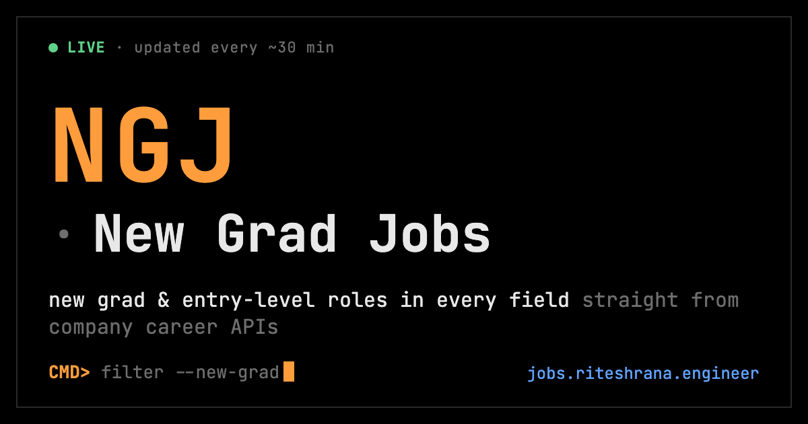

# 2026 New Grad Positions

**Fully automated** list of entry-level positions for 2025–2027 new graduates: software, data, engineering, finance, marketing, sales, healthcare and every other field, pulled straight from company career sites.

Unlike manually curated lists, this repository pulls directly from configured company APIs and refreshes **about every 30 minutes**, 24/7.

**[Open the live board →](https://jobs.riteshrana.engineer/)** · [Browse by role, company, city](https://jobs.riteshrana.engineer/jobs/) · [Guides](https://jobs.riteshrana.engineer/guides/) · [RSS alerts](https://jobs.riteshrana.engineer/feed.xml) · [How it works](https://jobs.riteshrana.engineer/about/)

**Contribute** by submitting an [issue](https://github.com/ambicuity/New-Grad-Jobs/issues/new/choose). See the [contribution guidelines](CONTRIBUTING.md) to get started.

> [!NOTE]
> **Solo-Maintained Project.** This repository is maintained by one person in spare time.
> PRs are reviewed within **1–2 weeks**. Bug fixes take priority over feature requests.
> Before opening an issue, read [SUPPORT.md](.github/SUPPORT.md).

---

## **Website & Autofill Extension**

Explore Zapply’s website and check out:
- Our Chrome extension, which autofills job applications in seconds.
- A dedicated job board featuring the latest openings across various roles.
- User accounts with multiple profiles for different resume types and roles.
- Job application tracking with streaks and commitment awards.

Experience an advanced career journey with us! 🚀

Sponsored by Zapply

---

## Sponsored by [Tailr](https://www.tailr.uk)

**[Tailr](https://www.tailr.uk) rewrites your résumé for each job posting and shows you the ATS match score** — so you stop getting auto-filtered by the same generic résumé. Free 10/day, no card required. This project is proudly sponsored by Tailr.

---

<!-- COUNTS:START - counts below are auto-synced from the scraper output jobs.json by scripts/sync_readme_counts.py -->
## Browse <!-- COUNT:total -->2997<!-- /COUNT --> Jobs by Category

| Category | Open Roles |
|----------|-----------:|
| [Software Engineering](#software-engineering) | <!-- COUNT:software_engineering -->1039<!-- /COUNT --> |
| [Frontend Engineering](#frontend-engineering) | <!-- COUNT:frontend -->13<!-- /COUNT --> |
| [Backend Engineering](#backend-engineering) | <!-- COUNT:backend -->17<!-- /COUNT --> |
| [Mobile Engineering](#mobile-engineering) | <!-- COUNT:mobile -->7<!-- /COUNT --> |
| [Security Engineering](#security-engineering) | <!-- COUNT:security -->92<!-- /COUNT --> |
| [Data Science & ML](#data-science--ml) | <!-- COUNT:data_ml -->129<!-- /COUNT --> |
| [Data Engineering](#data-engineering) | <!-- COUNT:data_engineering -->37<!-- /COUNT --> |
| [Data Analyst](#data-analyst) | <!-- COUNT:data_analyst -->9<!-- /COUNT --> |
| [Infrastructure & SRE](#infrastructure--sre) | <!-- COUNT:infrastructure_sre -->193<!-- /COUNT --> |
| [Product Management](#product-management) | <!-- COUNT:product_management -->5<!-- /COUNT --> |
| [Project Management](#project-management) | <!-- COUNT:project_management -->22<!-- /COUNT --> |
| [Quantitative Finance](#quantitative-finance) | <!-- COUNT:quant_finance -->19<!-- /COUNT --> |
| [Hardware Engineering](#hardware-engineering) | <!-- COUNT:hardware -->74<!-- /COUNT --> |
| [Engineering and Development](#engineering-and-development) | <!-- COUNT:engineering -->305<!-- /COUNT --> |
| [Creatives and Design](#creatives-and-design) | <!-- COUNT:design -->22<!-- /COUNT --> |
| [Business Analyst](#business-analyst) | <!-- COUNT:business_analyst -->84<!-- /COUNT --> |
| [Marketing](#marketing) | <!-- COUNT:marketing -->22<!-- /COUNT --> |
| [Sales](#sales) | <!-- COUNT:sales -->127<!-- /COUNT --> |
| [Accounting and Finance](#accounting-and-finance) | <!-- COUNT:accounting_finance -->167<!-- /COUNT --> |
| [Consulting](#consulting) | <!-- COUNT:consulting -->50<!-- /COUNT --> |
| [Human Resources](#human-resources) | <!-- COUNT:human_resources -->62<!-- /COUNT --> |
| [Legal and Compliance](#legal-and-compliance) | <!-- COUNT:legal -->44<!-- /COUNT --> |
| [Customer Service and Support](#customer-service-and-support) | <!-- COUNT:customer_support -->77<!-- /COUNT --> |
| [Supply Chain](#supply-chain) | <!-- COUNT:supply_chain -->99<!-- /COUNT --> |
| [Healthcare](#healthcare) | <!-- COUNT:healthcare -->116<!-- /COUNT --> |
| [Education and Training](#education-and-training) | <!-- COUNT:education -->6<!-- /COUNT --> |
| [Public Sector and Government](#public-sector-and-government) | <!-- COUNT:public_sector -->2<!-- /COUNT --> |
| [Arts and Entertainment](#arts-and-entertainment) | <!-- COUNT:arts_entertainment -->2<!-- /COUNT --> |
| [Management and Executive](#management-and-executive) | <!-- COUNT:management -->74<!-- /COUNT --> |
| [Other](#other) | <!-- COUNT:other -->82<!-- /COUNT --> |
<!-- COUNTS:END -->

---

<!-- CATEGORY-LISTINGS:START - auto-generated from the scraper output jobs.json by scripts/sync_readme_jobs.py; do not edit by hand -->

> **Live listings** — the 10 most recently posted roles per category, refreshed about every 30 minutes. Browse and filter all **2,997** live roles on the **[live job board](https://jobs.riteshrana.engineer/)**.

## Software Engineering

[Back to top](#2026-new-grad-positions)

| Company | Role | Location | Posted | Apply |
|---------|------|----------|--------|-------|
| Raytheon | Systems Engineer I-Onsite | US-MA-MARLBOROUGH-MA1 ~ 1001 Boston Post Rd ~ BLDG 1 | Today | [Apply](<https://globalhr.wd5.myworkdayjobs.com/job/US-MA-MARLBOROUGH-MA1--1001-Boston-Post-Rd--BLDG-1/Systems-Engineer-I_01874214>) |
| Unknown | Software Engineer \(New Graduates\) | HR, IN | Today | [Apply](<https://in.indeed.com/viewjob?jk=35d4196b6ece7531>) |
| Raytheon | Systems Engineer I - Tac Comm \(Onsite\) | US-IA-CEDAR RAPIDS-137 ~ 855 35Th St NE ~ BLDG 137 | Today | [Apply](<https://globalhr.wd5.myworkdayjobs.com/job/US-IA-CEDAR-RAPIDS-137--855-35Th-St-NE--BLDG-137/Systems-Engineer-I---Tac-Comm--Onsite-_01870089>) |
| SpaceX | Software Engineer, Manufacturing Infrastructure | Starbase, TX | Today | [Apply](<https://boards.greenhouse.io/spacex/jobs/8848613002?gh_jid=8848613002>) |
| SpaceX | Full Stack Software Engineer, Manufacturing Systems | Starbase, TX | Today | [Apply](<https://boards.greenhouse.io/spacex/jobs/8848609002?gh_jid=8848609002>) |
| SpaceX | Full Stack Software Engineer, Internal Applications | Bastrop, TX | Today | [Apply](<https://boards.greenhouse.io/spacex/jobs/8848604002?gh_jid=8848604002>) |
| Wipro | Junior .NET Software Engineer Channels | MH, IN | 1 day ago | [Apply](<https://in.indeed.com/viewjob?jk=40d598b8f8d97c63>) |
| InheritX Solutions Pvt. Ltd | Junior QA Engineer | GJ, IN | 1 day ago | [Apply](<https://in.indeed.com/viewjob?jk=9f971ed01df83949>) |
| icapital | Python Developer - Associate | RJ, IN | 1 day ago | [Apply](<https://in.indeed.com/viewjob?jk=24a62bd5a1ddf7a3>) |
| Nuro | Software Engineer, Cloud Infrastructure and Observability | Mountain View, California \(HQ\) | 1 day ago | [Apply](<https://nuro.ai/careersitem?gh_jid=8221208>) |

**[View all 1,039 Software Engineering roles on the live board](https://jobs.riteshrana.engineer/)**

## Frontend Engineering

[Back to top](#2026-new-grad-positions)

| Company | Role | Location | Posted | Apply |
|---------|------|----------|--------|-------|
| Ramp | Software Engineer, Frontend, Growth | New York City, NY, USA | 5 days ago | [Apply](<https://jobs.ashbyhq.com/ramp/7cd46077-05fe-4cd7-816f-5528638342f1>) |
| Reddit | Front End Software Engineer, Consumer Engineering | Remote - United States | 2026-09-17 | [Apply](<https://job-boards.greenhouse.io/reddit/jobs/8147559>) |
| CACI | Front-end Software Developer | Aberdeen Proving Ground, MD, US | 2026-09-16 | [Apply](<https://caci.wd1.myworkdayjobs.com/job/Aberdeen-Proving-Ground-MD-US/Front-end-Software-Developer_331152>) |
| Accenture | Junior Frontend Developer \(all genders\) | — | 2026-09-14 | [Apply](<https://accenture.wd103.myworkdayjobs.com/job/Kronberg-Building-Beta/Junior-Frontend-Developer--all-genders-_R00354171>) |
| Booz Allen Hamilton | Front End Software Engineer | Chantilly, VA | 2026-09-14 | [Apply](<https://bah.wd1.myworkdayjobs.com/job/Chantilly-VA/Front-End-Software-Engineer_R0249441>) |
| Reddit | Front End Software Engineer, Media Player | Remote - United States | 2026-09-11 | [Apply](<https://job-boards.greenhouse.io/reddit/jobs/8198102>) |
| Affirm | Software Engineer I, Frontend \(Upfunnel\) | Remote Canada | 2026-09-11 | [Apply](<https://job-boards.greenhouse.io/affirm/jobs/7985907003>) |
| CACI | Front-end Software Developer | Denver, CO, US | 2026-08-28 | [Apply](<https://caci.wd1.myworkdayjobs.com/job/Denver-CO-US/Front-end-Software-Developer_329940>) |
| Booz Allen Hamilton | Front-End Software Engineer | Chantilly, VA | 2026-08-28 | [Apply](<https://bah.wd1.myworkdayjobs.com/job/Chantilly-VA/Front-End-Software-Engineer_R0245772>) |
| Accenture | Web Developer Associate | — | 2026-08-28 | [Apply](<https://accenture.wd103.myworkdayjobs.com/job/Mumbai/Web-Developer-Associate_AIOC-S01652011-1>) |

**[View all 13 Frontend Engineering roles on the live board](https://jobs.riteshrana.engineer/)**

## Backend Engineering

[Back to top](#2026-new-grad-positions)

| Company | Role | Location | Posted | Apply |
|---------|------|----------|--------|-------|
| SpaceX | Software Engineer, Backend \(Python/C++\) | Hawthorne, CA | 1 day ago | [Apply](<https://boards.greenhouse.io/spacex/jobs/8845089002?gh_jid=8845089002>) |
| Affirm | Software Engineer II, Backend \(Identity Decisioning\) | Remote Canada | 2 days ago | [Apply](<https://job-boards.greenhouse.io/affirm/jobs/7985862003>) |
| Affirm | Software Engineer II, Backend \(Identity Decisioning\) | Remote US | 2 days ago | [Apply](<https://job-boards.greenhouse.io/affirm/jobs/7985860003>) |
| Xero | Associate Engineer \(Back End\) | Calgary, AB, CA | 4 days ago | [Apply](<https://ca.indeed.com/viewjob?jk=ef35619bf16c22ce>) |
| Lyft | Backend Software Engineer, Airports | San Francisco, CA | 2026-09-18 | [Apply](<https://app.careerpuck.com/job-board/lyft/job/8806570002?gh_jid=8806570002>) |
| Brex | Software Engineer II, Backend | Vancouver, British Columbia, Canada | 2026-09-16 | [Apply](<https://www.brex.com/careers/8815512002?gh_jid=8815512002>) |
| Brex | Software Engineer II, Backend | New York, New York, United States | 2026-09-16 | [Apply](<https://www.brex.com/careers/8815443002?gh_jid=8815443002>) |
| Brex | Software Engineer II, Backend | San Francisco, California, United States | 2026-09-16 | [Apply](<https://www.brex.com/careers/8815438002?gh_jid=8815438002>) |
| Stripe | Software Engineer, Backend | Seattle, WA | 2026-09-14 | [Apply](<https://stripe.com/jobs/search?gh_jid=8198280>) |
| OpenAI | Backend Software Engineer, ChatGPT ImageGen | San Francisco, California, United States | 2026-09-11 | [Apply](<https://jobs.ashbyhq.com/openai/e7a4ee23-138a-4004-916e-72a452e7d115>) |

**[View all 17 Backend Engineering roles on the live board](https://jobs.riteshrana.engineer/)**

## Mobile Engineering

[Back to top](#2026-new-grad-positions)

| Company | Role | Location | Posted | Apply |
|---------|------|----------|--------|-------|
| BJAK | iOS Software Engineer | United States, United States, United States | 2 days ago | [Apply](<https://jobs.ashbyhq.com/bjakcareer/b22150b6-5fa7-4842-b501-e5322f2f75b3>) |
| BJAK | Android Software Engineer | United States, United States, United States | 2 days ago | [Apply](<https://jobs.ashbyhq.com/bjakcareer/c4272eb4-56fc-4f3e-8d5a-cc14c7e7c4ef>) |
| BJAK | Android Software Engineer - AI Neobank App | India, India, India | 2026-09-01 | [Apply](<https://jobs.ashbyhq.com/bjakcareer/82349fdc-fc80-4da1-a39e-1f70dee09ba5>) |
| BJAK | Android Software Engineer - AI Neobank App | United States, United States, United States | 2026-09-01 | [Apply](<https://jobs.ashbyhq.com/bjakcareer/6cd46335-dae2-40e1-807a-b8f2dc18f618>) |
| Lyft | Android Software Engineer, Lyft Urban Solutions | Montreal, Canada | 2026-08-28 | [Apply](<https://app.careerpuck.com/job-board/lyft/job/8743513002?gh_jid=8743513002>) |
| StockX | Software Engineer - iOS | Bangalore, India | 2026-08-25 | [Apply](<https://job-boards.greenhouse.io/stockx/jobs/8742590002>) |
| OpenAI | Android Systems Engineer, Consumer Devices | San Francisco, California, United States | 2026-08-21 | [Apply](<https://jobs.ashbyhq.com/openai/b08126cc-8134-45f0-aeb3-4b00e96547de>) |

## Security Engineering

[Back to top](#2026-new-grad-positions)

| Company | Role | Location | Posted | Apply |
|---------|------|----------|--------|-------|
| Unknown | Junior DevSecOps Engineer \(CI/CD\) | Washington, DC, US | Today | [Apply](<https://www.indeed.com/viewjob?jk=97adaa5c8b8706e1>) |
| SpaceX | Security Engineer \(Red Team\) | Starbase, TX | 1 day ago | [Apply](<https://boards.greenhouse.io/spacex/jobs/8847094002?gh_jid=8847094002>) |
| Stripe | Offensive Security Engineer | US - Remote | 1 day ago | [Apply](<https://stripe.com/jobs/search?gh_jid=8233889>) |
| SpaceX | Security Engineer \(Vulnerability Management\) | Starbase, TX | 1 day ago | [Apply](<https://boards.greenhouse.io/spacex/jobs/8843974002?gh_jid=8843974002>) |
| Leidos | Junior Security Engineer | Bethesda, MD | 2 days ago | [Apply](<https://leidos.wd5.myworkdayjobs.com/job/Bethesda-MD/Junior-Security-Engineer_R-00192204>) |
| Spotify | Security Engineer - Detection and Response | New York, NY | 2 days ago | [Apply](<https://jobs.lever.co/spotify/cb29d857-395b-401d-9749-367e666ff870>) |
| Wiz | Security Engineer, Product &amp; Production Infrastructure | Remote - USA | 2 days ago | [Apply](<https://www.wiz.io/careers/job/4711762006/:title?gh_jid=4711762006>) |
| Northrop Grumman | 2026 Associate Cybersecurity Analyst - Pathways Program - Rocket Center WV | United States-West Virginia-Rocket Center | 3 days ago | [Apply](<https://ngc.wd1.myworkdayjobs.com/job/United-States-West-Virginia-Rocket-Center/XMLNAME-2026-Associate-Cybersecurity-Analyst---Pathways-Program---Rocket-Center-WV_R10252865>) |
| Raytheon | Systems Security Engineer I – Anti-Tamper / Program Protection \(Onsite-Tucson, AZ\) – P1 | US-AZ-TUCSON-801 ~ 1151 E Hermans Rd ~ BLDG 801 \(External Site\) | 3 days ago | [Apply](<https://globalhr.wd5.myworkdayjobs.com/job/US-AZ-TUCSON-801--1151-E-Hermans-Rd--BLDG-801-External-Site/Systems-Security-Engineer-I---Anti-Tamper---Program-Protection--Onsite-Tucson--AZ----P1_01873154>) |
| Booz Allen Hamilton | Cyber Technical Specialist, Junior | Suffolk, VA | 3 days ago | [Apply](<https://bah.wd1.myworkdayjobs.com/job/Suffolk-VA/Cyber-Technical-Specialist--Junior_R0249897>) |

**[View all 92 Security Engineering roles on the live board](https://jobs.riteshrana.engineer/)**

## Data Science & ML

[Back to top](#2026-new-grad-positions)

| Company | Role | Location | Posted | Apply |
|---------|------|----------|--------|-------|
| VodafoneZiggo | AGM - Big Data Scientist | MH, IN | 1 day ago | [Apply](<https://in.indeed.com/viewjob?jk=6d4397ad46884cdc>) |
| Glean | Machine Learning Engineer, Search Quality | San Francisco, CA | 1 day ago | [Apply](<https://job-boards.greenhouse.io/gleanwork/jobs/4738120005>) |
| Mortenson Construction | Data Scientist | Minneapolis, MN, US | 2 days ago | [Apply](<https://www.indeed.com/viewjob?jk=e2e6473039853814>) |
| Navy Federal Credit Union | Associate Data Scientist | Vienna, VA, US | 2 days ago | [Apply](<https://www.indeed.com/viewjob?jk=83bfbab79e06c09e>) |
| University of British Columbia | SAU Data Scientist | Vancouver, BC, CA | 2 days ago | [Apply](<https://ca.indeed.com/viewjob?jk=42065f65148d3b36>) |
| Unknown | Data Scientist | Minneapolis, MN, US | 2 days ago | [Apply](<https://www.indeed.com/viewjob?jk=7d29a2300f5c512d>) |
| Mastercard | Field Data Scientist | Toronto, Canada | 2 days ago | [Apply](<https://mastercard.wd1.myworkdayjobs.com/job/Toronto-Canada/Field-Data-Scientist_R-291566>) |
| Accenture | Junior GenAI Engineer \(AI&amp;Data\) | — | 2 days ago | [Apply](<https://accenture.wd103.myworkdayjobs.com/job/Warsaw-Sienna-39/Junior-GenAI---Conversational-Analytics-Engineer--AI-Data-_R00318994>) |
| Accenture | Junior Applied AI Engineer \(all genders\) | — | 2 days ago | [Apply](<https://accenture.wd103.myworkdayjobs.com/job/Kronberg-Campus-Kronberg-1/AI-Native-Software-Engineering--Junior-_R00345665>) |
| Discord | Data Scientist - Client Platform | San Francisco Bay Area | 2 days ago | [Apply](<https://job-boards.greenhouse.io/discord/jobs/8840756002>) |

**[View all 129 Data Science & ML roles on the live board](https://jobs.riteshrana.engineer/)**

## Data Engineering

[Back to top](#2026-new-grad-positions)

| Company | Role | Location | Posted | Apply |
|---------|------|----------|--------|-------|
| TD | PGTL II - Data Discovery | Mount Laurel, NJ, US | 2 days ago | [Apply](<https://www.indeed.com/viewjob?jk=d233038d7e704ed6>) |
| PwC | Data and Product Analyst \(Contract\) | Toronto | 2 days ago | [Apply](<https://pwc.wd3.myworkdayjobs.com/job/Toronto/Data-and-Product-Analyst--Contract-_750249WD-3>) |
| AppLovin | ML Data Infrastructure Engineer | Palo Alto, CA | 2 days ago | [Apply](<https://boards.greenhouse.io/applovin/jobs/4716524006?gh_jid=4716524006>) |
| Accenture | Data Engineer | — | 4 days ago | [Apply](<https://accenture.wd103.myworkdayjobs.com/job/Hyderabad/Data-Engineer_ATCI-5765995-S2068087-1>) |
| Accenture | Data Engineer | — | 4 days ago | [Apply](<https://accenture.wd103.myworkdayjobs.com/job/Hyderabad/Data-Engineer_ATCI-5765994-S2068784-1>) |
| The Walt Disney Company | Software Data Engineer | Burbank, CA, USA | 5 days ago | [Apply](<https://disney.wd5.myworkdayjobs.com/job/Burbank-CA-USA/Software-Data-Engineer_10160911>) |
| General Dynamics | Data Engineer | USA VA Falls Church | 5 days ago | [Apply](<https://gdit.wd5.myworkdayjobs.com/job/USA-VA-Falls-Church/Data-Engineer_RQ225443-1>) |
| Orion Innovation | Azure Data Engineer | Montvale, New Jersey, United States | 5 days ago | [Apply](<https://www.orioninc.com/careers/job/?gh_jid=4714763006>) |
| General Dynamics | NCIS Data Engineer / Active Secret clearance | USA VA Quantico | 2026-09-20 | [Apply](<https://gdit.wd5.myworkdayjobs.com/job/USA-VA-Quantico/NCIS-Data-Engineer---Active-Secret-clearance_RQ228816-1>) |
| Campfire | Data Engineer | 300 Montgomery St Suite 500 San Francisco, California 94104, United States | 2026-09-18 | [Apply](<https://jobs.ashbyhq.com/campfire/2b30b7a1-3649-40e5-804a-ea07bfc94318>) |

**[View all 37 Data Engineering roles on the live board](https://jobs.riteshrana.engineer/)**

## Data Analyst

[Back to top](#2026-new-grad-positions)

| Company | Role | Location | Posted | Apply |
|---------|------|----------|--------|-------|
| Pride Mobility | Junior Manufacturing Data Analyst | Duryea, PA, US | 2 days ago | [Apply](<https://www.indeed.com/viewjob?jk=4bd47e8e6033538a>) |
| adMarketplace | Graduate Data Analyst | New York, NY, US | 3 days ago | [Apply](<https://www.indeed.com/viewjob?jk=ef947638ab6b849b>) |
| Raytheon | Associate Business Intelligence Analyst\(AI/ML,Generative AI &amp; Python,1-3 years,Bangalore\) | IN-KA-BENGALURU-NORTHGATE ~ Sy No 2/2 Venkatala Village ~ SY NO 2/2 VENKATALA VILLAGE, Yelahanka Hobli | 3 days ago | [Apply](<https://globalhr.wd5.myworkdayjobs.com/job/IN-KA-BENGALURU-NORTHGATE--Sy-No-22-Venkatala-Village--SY-NO-22-VENKATALA-VILLAGE-Yelahanka-Hobli/Associate-Business-Intelligence-Analyst-AI-ML-Generative-AI---Python-1-3-years-Bangalore-_01876631>) |
| Citi | Research Product Associate - Data Analytics Operations - Officer | Mumbai Maharashtra India | 6 days ago | [Apply](<https://citi.wd5.myworkdayjobs.com/job/Mumbai-Maharashtra-India/Research-Product-Associate---Data-Analytics-Operations---Officer_26992131>) |
| Citi | Research Product Associate - Data Analytics Operations - Officer | Mumbai Maharashtra India | 6 days ago | [Apply](<https://citi.wd5.myworkdayjobs.com/job/Mumbai-Maharashtra-India/Research-Product-Associate---Data-Analytics-Operations---Officer_26992127>) |
| Philips | Full Time- Graduate Development Program-AI &amp; Analytics Associate-Nashville, TN or Cambridge, MA-2027 | Nashville, Tennessee, United States | 2026-09-14 | [Apply](<https://philips.wd3.myworkdayjobs.com/job/Nashville-Tennessee-United-States/Full-Time--Graduate-Development-Program-AI---Analytics-Associate-Nashville--TN-or-Cambridge--MA-2026_587083>) |
| Checkr | Product Data Analyst II | San Francisco, California, United States | 2026-09-11 | [Apply](<https://job-boards.greenhouse.io/checkr/jobs/8188741>) |
| Capital One | Associate, Data Analyst - New Grad, 2027 Start | Toronto, ON | 2026-09-08 | [Apply](<https://capitalone.wd12.myworkdayjobs.com/job/Toronto-ON/Associate--Data-Analyst---New-Grad--2027-Start_R999613-1>) |
| Bristol Myers Squibb | Data Analyst II, Incentive Compensation | Hyderabad - TS - IN | 2026-09-03 | [Apply](<https://bristolmyerssquibb.wd5.myworkdayjobs.com/job/Hyderabad---TS---IN/EG-090---Information-Technology---Applications-Development_R1605919>) |

## Infrastructure & SRE

[Back to top](#2026-new-grad-positions)

| Company | Role | Location | Posted | Apply |
|---------|------|----------|--------|-------|
| CALVIN KLEIN | Network Engineer | KA, IN | Today | [Apply](<https://in.indeed.com/viewjob?jk=06db15934526099b>) |
| NTT DATA | Network Engineer - L1 | MH, IN | Today | [Apply](<https://in.indeed.com/viewjob?jk=d5fa728000d6bcee>) |
| Serco | Network Engineer - San Diego, CA | San Diego, CA, US | 1 day ago | [Apply](<https://www.indeed.com/viewjob?jk=efe0920276d9c92b>) |
| CALVIN KLEIN | Network Engineer | KA, IN | 1 day ago | [Apply](<https://in.indeed.com/viewjob?jk=7a03326eecad45dc>) |
| Deloitte | End User Support - Associate Services Specialist I - Hyderabad | TS, IN | 1 day ago | [Apply](<https://in.indeed.com/viewjob?jk=22a6a56eb3d9d646>) |
| Deloitte | End User Support - Associate Services Specialist I - Bangalore | KA, IN | 1 day ago | [Apply](<https://in.indeed.com/viewjob?jk=3638a746b168277b>) |
| SpaceX | Network Engineer \(Starlink Maritime\) | Redmond, WA | 1 day ago | [Apply](<https://boards.greenhouse.io/spacex/jobs/8842743002?gh_jid=8842743002>) |
| SpaceX | Site Reliability Engineer, Kubernetes Platform \(Top Secret Clearance\) | Hawthorne, CA | 2 days ago | [Apply](<https://boards.greenhouse.io/spacex/jobs/8843951002?gh_jid=8843951002>) |
| CACI | Network Engineer \(SD-WAN\) | High Point, NC, US | 2 days ago | [Apply](<https://caci.wd1.myworkdayjobs.com/job/High-Point-NC-US/Network-Engineer--SD-WAN-_332655>) |
| JPMorganChase | Site Reliability Engineer II - Java/Python, Kubernetes, AWS, Terraform | KA, IN | 2 days ago | [Apply](<https://in.indeed.com/viewjob?jk=8e9c8f82ae16fd19>) |

**[View all 193 Infrastructure & SRE roles on the live board](https://jobs.riteshrana.engineer/)**

## Product Management

[Back to top](#2026-new-grad-positions)

| Company | Role | Location | Posted | Apply |
|---------|------|----------|--------|-------|
| Recruiterflow | Associate Product Manager | KA, IN | 2 days ago | [Apply](<https://in.indeed.com/viewjob?jk=b61774747cd47665>) |
| The Walt Disney Company | Associate Product Manager \(Project Hire\) | Orlando, FL, USA | 5 days ago | [Apply](<https://disney.wd5.myworkdayjobs.com/job/Orlando-FL-USA/Associate-Product-Manager--Project-Hire-_10159844>) |
| The Home Depot | Associate Product Manager | GLOBAL CUSTOM COMMERCE/BLINDS OFFICE, HOUSTON - 2140 | 2026-09-15 | [Apply](<https://homedepot.wd5.myworkdayjobs.com/job/GLOBAL-CUSTOM-COMMERCEBLINDS-OFFICE-HOUSTON---2140/Associate-Product-Manager_Req193142>) |
| Robinhood | Associate Product Manager \(New Grad\) | New York, NY | 2026-09-14 | [Apply](<https://boards.greenhouse.io/robinhood/jobs/8199973?t=gh_src=&gh_jid=8199973>) |
| Roblox | \[2027\] Associate Product Manager, Early Career | San Mateo, CA, United States | 2026-09-02 | [Apply](<https://careers.roblox.com/jobs/8143976?gh_jid=8143976>) |

## Project Management

[Back to top](#2026-new-grad-positions)

| Company | Role | Location | Posted | Apply |
|---------|------|----------|--------|-------|
| Precise Systems | MK 41 VLS Program Analyst, Associate | Port Hueneme, CA, US | 1 day ago | [Apply](<https://www.indeed.com/viewjob?jk=13dc20eb0641f2bb>) |
| Fred Hutchinson Cancer Center | Program Coordinator I: Provider Deployment and Advanced Practice Provider Programs | Seattle, WA, US | 2 days ago | [Apply](<https://www.indeed.com/viewjob?jk=e44b3262ea86c987>) |
| MDS Aero Support Corporation | Project Coordinator / Integrator - Entry Level | Ottawa, ON, CA | 2 days ago | [Apply](<https://ca.indeed.com/viewjob?jk=b369b4c523db8462>) |
| Corgan | Project Specialist, Interior Design / 2026 New Grad - Dallas Aviation | Dallas, TX, US | 2 days ago | [Apply](<https://www.indeed.com/viewjob?jk=bbd9a35231c614ac>) |
| The Walt Disney Company | COE Associate Project Manager | Burbank, CA, USA | 2 days ago | [Apply](<https://disney.wd5.myworkdayjobs.com/job/Burbank-CA-USA/COE-Associate-Project-Manager_10161038>) |
| US Farm Service Agency | County Program Analyst/Trainee | Lancaster, NH, US | 2 days ago | [Apply](<https://www.indeed.com/viewjob?jk=84fbc5400db91c90>) |
| Western University | Program Coordinator I | London, ON, CA | 2 days ago | [Apply](<https://ca.indeed.com/viewjob?jk=3b93aeed1a8fdf2d>) |
| The Walt Disney Company | Construction - Associate Project Manager | Lake Buena Vista, FL, USA | 3 days ago | [Apply](<https://disney.wd5.myworkdayjobs.com/job/Lake-Buena-Vista-FL-USA/Construction---Associate-Project-Manager_10161624-1>) |
| Rutgers University | Program Coordinator I | Piscataway, NJ, US | 3 days ago | [Apply](<https://www.indeed.com/viewjob?jk=d52771df75669367>) |
| Booz Allen Hamilton | Project Management Specialist, Junior | Washington, DC | 4 days ago | [Apply](<https://bah.wd1.myworkdayjobs.com/job/Washington-DC/Project-Management-Specialist--Junior_R0249781>) |

**[View all 22 Project Management roles on the live board](https://jobs.riteshrana.engineer/)**

## Quantitative Finance

[Back to top](#2026-new-grad-positions)

| Company | Role | Location | Posted | Apply |
|---------|------|----------|--------|-------|
| State of Arkansas | PUBLIC SERVICE RATE CASE ANALYST I | Little Rock, AR, US | 1 day ago | [Apply](<https://www.indeed.com/viewjob?jk=8f99ad4d34c0cb91>) |
| TransAlta Corporation | Trading Development Program | Calgary, AB, CA | 2 days ago | [Apply](<https://ca.indeed.com/viewjob?jk=5761580b7b294a66>) |
| Macquarie Group | 2027 Commodities and Global Markets Graduate Program - Commodities, Structuring | Houston, TX, US | 2 days ago | [Apply](<https://www.indeed.com/viewjob?jk=f4d47e15cd206149>) |
| Velera | Associate Experience Design Researcher | Remote, US | 2 days ago | [Apply](<https://www.indeed.com/viewjob?jk=dfd6e6d6b611fa43>) |
| Rockwood Company | Junior Analyst \(Summer 2027\) | Washington, DC, US | 3 days ago | [Apply](<https://www.indeed.com/viewjob?jk=d6caf78404969a1d>) |
| McMaster University | RESEARCH COORDINATOR \(II\) - JD00439 | Hamilton, ON, CA | 4 days ago | [Apply](<https://ca.indeed.com/viewjob?jk=3432afa4c35bb8a1>) |
| Belvedere Trading | Early Career Talent Partner - Trading | Chicago, IL, US | 5 days ago | [Apply](<https://www.indeed.com/viewjob?jk=7faf7993eca13a65>) |
| Old Mission Capital | Floor Trader - 2027 Graduate Program \(August Start\) | Chicago, IL, United States | 2026-09-16 | [Apply](<https://www.oldmissioncapital.com/careers/?gh_jid=7993756003>) |
| Fidelity | AM Quantitative Analyst II | Boston, MA | 2026-09-09 | [Apply](<https://fmr.wd1.myworkdayjobs.com/job/Boston-MA/AM-Quantitative-Analyst-II_2134861>) |
| RBC | Associate - Quantitative Analyst | TORONTO, Ontario, Canada | 2026-09-08 | [Apply](<https://rbc.wd3.myworkdayjobs.com/job/TORONTO-Ontario-Canada/Associate---Quantitative-Analyst_R-0000178962-1>) |

**[View all 19 Quantitative Finance roles on the live board](https://jobs.riteshrana.engineer/)**

## Hardware Engineering

[Back to top](#2026-new-grad-positions)

| Company | Role | Location | Posted | Apply |
|---------|------|----------|--------|-------|
| BD | Electrical Service Engineer \(Entry Level\) Milwaukee | Sparks, MD, US | 1 day ago | [Apply](<https://www.indeed.com/viewjob?jk=f7050803a3168440>) |
| Raytheon | Digital Electronics Electrical Engineer II – Onsite | US-MA-MARLBOROUGH-MA2 ~ 1001 Boston Post Rd ~ BLDG 2 | 2 days ago | [Apply](<https://globalhr.wd5.myworkdayjobs.com/job/US-MA-MARLBOROUGH-MA2--1001-Boston-Post-Rd--BLDG-2/Digital-Electronics-Electrical-Engineer-II---Onsite_01877281>) |
| Boeing | Associate Electrical Engineer | USA - Heath, OH | 2 days ago | [Apply](<https://boeing.wd1.myworkdayjobs.com/job/USA---Heath-OH/Associate-Electrical-Engineer_JR2026522416>) |
| Raytheon | Digital Electronics Electrical Engineer I –Onsite | US-MA-TEWKSBURY-TB1 ~ 50 Apple Hill Dr ~ ASSABET BLDG | 2 days ago | [Apply](<https://globalhr.wd5.myworkdayjobs.com/job/US-MA-TEWKSBURY-TB1--50-Apple-Hill-Dr--ASSABET-BLDG/Digital-Electronics-Electrical-Engineer-I--Onsite_01877283>) |
| Raytheon | FPGA Engineer II | US-TX-PLANO-465 ~ 465 Independence Pkwy ~ INDEPENDENCE | 2 days ago | [Apply](<https://globalhr.wd5.myworkdayjobs.com/job/US-TX-PLANO-465--465-Independence-Pkwy--INDEPENDENCE/FPGA-Engineer-II_01866337>) |
| Shield AI | RF Engineer I \(R6108\) | Seattle, WA, US | 2 days ago | [Apply](<https://www.indeed.com/viewjob?jk=97b144586649175c>) |
| Raytheon | Electrical Engineer II | US-TX-MCKINNEY-513WA ~ 2501 W University Dr ~ WING A BLDG | 2 days ago | [Apply](<https://globalhr.wd5.myworkdayjobs.com/job/US-TX-MCKINNEY-513WA--2501-W-University-Dr--WING-A-BLDG/Electrical-Engineer-II_01873455>) |
| Northrop Grumman | 2026 Associate Electronics Engineer - Baltimore MD | United States-Maryland-Baltimore | 2 days ago | [Apply](<https://ngc.wd1.myworkdayjobs.com/job/United-States-Maryland-Baltimore/XMLNAME-2026-Associate-Electronics-Engineer---Baltimore-MD_R10252480-1>) |
| Arup | Graduate Power Systems \(Available 2027\) | Toronto, ON, CA | 2 days ago | [Apply](<https://ca.indeed.com/viewjob?jk=2d6ab95e3c9a2c4c>) |
| H.H. Angus | Electrical Engineering Designer - 2027 New Graduate Program | Ottawa, ON, CA | 2 days ago | [Apply](<https://ca.indeed.com/viewjob?jk=425ea84485b7fae5>) |

**[View all 74 Hardware Engineering roles on the live board](https://jobs.riteshrana.engineer/)**

## Engineering and Development

[Back to top](#2026-new-grad-positions)

| Company | Role | Location | Posted | Apply |
|---------|------|----------|--------|-------|
| CANADIAN CONSTRUCTION &amp; CONSULTANT ENGINEERS INC. | Junior HVAC Engineer | Markham, ON, CA | Today | [Apply](<https://ca.indeed.com/viewjob?jk=b5332a4f1c89abb5>) |
| Astranis | Electrical Integration Associate - Avionics \(Winter 2027\) | San Francisco | 1 day ago | [Apply](<https://job-boards.greenhouse.io/astranis/jobs/4704795006>) |
| Texas Instruments | Entry Level Manufacturing Maintenance Specialist \(Pit Crew\) - \(Sherman, TX\) | Sherman, TX, US | 1 day ago | [Apply](<https://www.indeed.com/viewjob?jk=b7bf14fc9482cd28>) |
| Unknown | Fresher Architectural Engineer / Structural Engineer – Technical Coordinator Trainee | Remote, IN | 1 day ago | [Apply](<https://in.indeed.com/viewjob?jk=8bef674a000b6b7a>) |
| Unknown | MECHANICAL ENGINEER I | Jacksonville, FL, US | 1 day ago | [Apply](<https://www.indeed.com/viewjob?jk=d44d735632315f37>) |
| General Dynamics | Engineer Associate | USA VA Chesapeake | 1 day ago | [Apply](<https://gdit.wd5.myworkdayjobs.com/job/USA-VA-Chesapeake/Engineer-Associate_RQ229052-1>) |
| Texas Instruments | Entry Level Manufacturing Maintenance Specialist \(Pit Crew\) - \(Dallas/Richardson, TX\) | Richardson, TX, US | 1 day ago | [Apply](<https://www.indeed.com/viewjob?jk=d283f2b5ef3d3c36>) |
| Odyssey Systems Consulting Group | Junior Systems Integration and Test Engineer | Niceville, FL, US | 1 day ago | [Apply](<https://www.indeed.com/viewjob?jk=8cf6346864c4e878>) |
| Abbott | Equipment and Automation Engineer II | Madison, WI, US | 1 day ago | [Apply](<https://www.indeed.com/viewjob?jk=72662f9b25cef773>) |
| General Dynamics Information Technology | Engineer Associate | Chesapeake, VA, US | 1 day ago | [Apply](<https://www.indeed.com/viewjob?jk=2700c5e82b78eca0>) |

**[View all 305 Engineering and Development roles on the live board](https://jobs.riteshrana.engineer/)**

## Creatives and Design

[Back to top](#2026-new-grad-positions)

| Company | Role | Location | Posted | Apply |
|---------|------|----------|--------|-------|
| Arup | Graduate Architectural Designer \(Available 2027\) | Toronto, ON, CA | 2 days ago | [Apply](<https://ca.indeed.com/viewjob?jk=b1a9cd463a1b70a6>) |
| WSP | Junior Highway Designer | Mississauga, ON, CA | 2 days ago | [Apply](<https://ca.indeed.com/viewjob?jk=d23e9847346727a0>) |
| University of Manitoba | Assistant or Associate Professor, Space Systems Design | Winnipeg, MB, CA | 2 days ago | [Apply](<https://ca.indeed.com/viewjob?jk=c56d4bcb44cfec06>) |
| Arup | Graduate BIM Designer \(Available 2027\) | Toronto, ON, CA | 2 days ago | [Apply](<https://ca.indeed.com/viewjob?jk=d60f03f1053c4e1d>) |
| Petersen West | Associate Graphic Designer | Orem, UT, US | 3 days ago | [Apply](<https://www.indeed.com/viewjob?jk=e487d30b99a14985>) |
| Figma | Early Career, Product Designer \(2027\) | San Francisco, CA • New York, NY | 4 days ago | [Apply](<https://boards.greenhouse.io/figma/jobs/6180053004?gh_jid=6180053004>) |
| Amazon.com | UX Designer I , Talent Acquisition - Products | Seattle, WA, US | 4 days ago | [Apply](<https://www.indeed.com/viewjob?jk=074b0943defdc4d3>) |
| Sigma IT Park Co-operative Society | Junior Motion Graphic Designer | MH, IN | 4 days ago | [Apply](<https://in.indeed.com/viewjob?jk=63443bf06008ea45>) |
| SocioLabs | Graphic Designer Trainee | DL, IN | 5 days ago | [Apply](<https://in.indeed.com/viewjob?jk=57a1ec2d8daa43c9>) |
| Buro Happold | Graduate BIM &amp; Computational Designer - Los Angeles - Summer 2027 | Los Angeles, CA, US | 5 days ago | [Apply](<https://www.indeed.com/viewjob?jk=ca7c9e5549eb3647>) |

**[View all 22 Creatives and Design roles on the live board](https://jobs.riteshrana.engineer/)**

## Business Analyst

[Back to top](#2026-new-grad-positions)

| Company | Role | Location | Posted | Apply |
|---------|------|----------|--------|-------|
| SECRETARY OF STATE | ANALYST II | CA, US | 1 day ago | [Apply](<https://www.indeed.com/viewjob?jk=8b8dbf24a1523694>) |
| MFA Oil Company | Business Analyst | Columbia, MO, US | 1 day ago | [Apply](<https://www.indeed.com/viewjob?jk=d34e470973e91478>) |
| BJAK | Business Operations Associate | United States, United States, United States | 2 days ago | [Apply](<https://jobs.ashbyhq.com/bjakcareer/dc5b5dec-ba95-46f7-ade1-6790712e2878>) |
| BJAK | Business Operations Associate | United States, United States, United States | 2 days ago | [Apply](<https://jobs.ashbyhq.com/bjakcareer/05f3ab94-5aeb-4ab9-bed5-cd9135d8f56b>) |
| Boeing | JR2026517219 Methods Process Analyst \(Entry-Level or Associate\) | USA - Seattle, WA | 2 days ago | [Apply](<https://boeing.wd1.myworkdayjobs.com/job/USA---Seattle-WA/JR2026517219-Methods-Process-Analyst--Entry-Level-or-Associate-_JR2026525024-1>) |
| NTT DATA | Associate Collections Analyst | MH, IN | 2 days ago | [Apply](<https://in.indeed.com/viewjob?jk=ad8e38020e2dcc47>) |
| The University of Michigan | REGIONAL COMMUNITY CONNECT FINANCIAL BUSINESS ANALYST | Lansing, MI, US | 2 days ago | [Apply](<https://www.indeed.com/viewjob?jk=47501f6038100d00>) |
| Coloplast | Business Analyst \(6 months\) | UP, IN | 2 days ago | [Apply](<https://in.indeed.com/viewjob?jk=b05f497e780f05aa>) |
| Texas Department of Transportation | Budget Analyst II/III | Austin, TX, US | 2 days ago | [Apply](<https://www.indeed.com/viewjob?jk=1e11b707a5c80396>) |
| Intel | Business Analyst | Virtual US | 2 days ago | [Apply](<https://intel.wd1.myworkdayjobs.com/job/Virtual-US/Business-Analyst_JR0284479>) |

**[View all 84 Business Analyst roles on the live board](https://jobs.riteshrana.engineer/)**

## Marketing

[Back to top](#2026-new-grad-positions)

| Company | Role | Location | Posted | Apply |
|---------|------|----------|--------|-------|
| Independent Contractor/Consultant | Entry Level Sales and Marketing Representative | Remote, US | Today | [Apply](<https://www.indeed.com/viewjob?jk=cab1a090cf35e316>) |
| THE SHOOLIN GROUP | Digital Marketing Associate | KA, IN | 1 day ago | [Apply](<https://in.indeed.com/viewjob?jk=5ba6aa8c27f7dd9d>) |
| Unknown | Junior Digital Marketing Executive | TS, IN | 1 day ago | [Apply](<https://in.indeed.com/viewjob?jk=f5034c1b5ac9cdd1>) |
| Stay Connected Management Inc | Sales &amp; Marketing Trainee | Stafford, TX, US | 1 day ago | [Apply](<https://www.indeed.com/viewjob?jk=6cbf5e9c1ff521a1>) |
| Imperio Global | Marketing &amp; Events Associate | Rochester, NY, US | 1 day ago | [Apply](<https://www.indeed.com/viewjob?jk=ec60b9e0f47a4f87>) |
| Stay Connected Management Inc | Energy Sales &amp; Marketing Associate | Lansing, IL, US | 1 day ago | [Apply](<https://www.indeed.com/viewjob?jk=7895c557d9fb3fb1>) |
| Precision Medicine Group | Strategic Account Associate, Medical Communications | Remote, United States | 1 day ago | [Apply](<https://job-boards.greenhouse.io/precisionmedicinegroup/jobs/6206614004>) |
| BJAK | PR &amp; Communications Associate | United States, United States, United States | 2 days ago | [Apply](<https://jobs.ashbyhq.com/bjakcareer/4e7175d9-79c4-416f-9c17-c435c8826d33>) |
| BJAK | Communications Associate | United States, United States, United States | 2 days ago | [Apply](<https://jobs.ashbyhq.com/bjakcareer/c480c48a-eecf-4b6d-96cc-1c284a252de4>) |
| Western University | Digital Marketing Associate \(Temporary Contract\) | London, ON, CA | 2 days ago | [Apply](<https://ca.indeed.com/viewjob?jk=fb9f2c673ffdbf0f>) |

**[View all 22 Marketing roles on the live board](https://jobs.riteshrana.engineer/)**

## Sales

[Back to top](#2026-new-grad-positions)

| Company | Role | Location | Posted | Apply |
|---------|------|----------|--------|-------|
| Break Time Convenience Store | Sales Associate | Ashland, MO, US | Today | [Apply](<https://www.indeed.com/viewjob?jk=09499fa88a153559>) |
| Stay Connected Management Inc | Sales &amp; Leadership Development Associate | Spring Lake, NC, US | 1 day ago | [Apply](<https://www.indeed.com/viewjob?jk=0ccf391ec2ba6e06>) |
| Unknown | Business Development Associate | GJ, IN | 1 day ago | [Apply](<https://in.indeed.com/viewjob?jk=9ba6870982e42434>) |
| Caleres Inc. | Part-Time Sales Associate - Famous Footwear | Sioux Falls, SD, US | 1 day ago | [Apply](<https://www.indeed.com/viewjob?jk=13f016100c17f676>) |
| CALVIN KLEIN | Sales Support Associate - Part Time | Tinton Falls, NJ, US | 1 day ago | [Apply](<https://www.indeed.com/viewjob?jk=1a48347be5370ecd>) |
| Elysian Consultants | Sales Associate | Fullerton, CA, US | 1 day ago | [Apply](<https://www.indeed.com/viewjob?jk=2301f7e0457fdad5>) |
| Unknown | Entry Level Sales Associate | Rockford, IL, US | 1 day ago | [Apply](<https://www.indeed.com/viewjob?jk=d37114c8c0b607da>) |
| Caleres Inc. | Part-Time Sales Associate - Famous Footwear | Lake Worth, TX, US | 1 day ago | [Apply](<https://www.indeed.com/viewjob?jk=e9fba3dc3ea157d8>) |
| Caleres Inc. | Part-Time Sales Associate - Famous Footwear | Little Rock, AR, US | 1 day ago | [Apply](<https://www.indeed.com/viewjob?jk=5d2a1e0ef603eae0>) |
| Unknown | Business Development Associate | GJ, IN | 1 day ago | [Apply](<https://in.indeed.com/viewjob?jk=92dea904242283cc>) |

**[View all 127 Sales roles on the live board](https://jobs.riteshrana.engineer/)**

## Accounting and Finance

[Back to top](#2026-new-grad-positions)

| Company | Role | Location | Posted | Apply |
|---------|------|----------|--------|-------|
| Mattamy Homes | Associate, CPA Leadership Development Program | Toronto, ON, CA | 1 day ago | [Apply](<https://ca.indeed.com/viewjob?jk=38953ac956032085>) |
| Anduril Industries | Finance Associate, Engineering Finance | Costa Mesa, California, United States | 1 day ago | [Apply](<https://boards.greenhouse.io/andurilindustries/jobs/5248742007?gh_jid=5248742007>) |
| Accenture | Tax Associate | — | 2 days ago | [Apply](<https://accenture.wd103.myworkdayjobs.com/job/Bengaluru/Tax-Associate_AIOC-S01667716-1>) |
| NBH Bank | Middle Market Banking - Loan Specialist II | Salt Lake City, UT, US | 2 days ago | [Apply](<https://www.indeed.com/viewjob?jk=cdd4349c14e27c1c>) |
| Sacred Heart University | Business Office - Accountant II | Fairfield, CT, US | 2 days ago | [Apply](<https://www.indeed.com/viewjob?jk=ebdb6a0a9e43f93e>) |
| Intact | Analyst II, Treasury | Saint-Hyacinthe, QC, CA | 2 days ago | [Apply](<https://ca.indeed.com/viewjob?jk=50d4686cea16cac9>) |
| Bloomberg Industry Group | Finance Associate \(INDG\) | Arlington, VA, US | 2 days ago | [Apply](<https://www.indeed.com/viewjob?jk=bdf83f8ccc5feeb6>) |
| Cerity Partners | Wealth Planner / New College Graduate 2027 | Houston, TX, US | 2 days ago | [Apply](<https://www.indeed.com/viewjob?jk=38476c96cdca38e8>) |
| Western Alliance Bank | 2027 Commercial Banking Development Program - Credit Analyst - Phoenix, AZ - Credit Approval C&amp;I | Phoenix, AZ, US | 2 days ago | [Apply](<https://www.indeed.com/viewjob?jk=ce5c0c45d4b8fe83>) |
| Western Alliance Bank | 2027 Commercial Banking Development Program - Credit Analyst - Beverly Hills, CA - Technology &amp; Innovation Banking | Beverly Hills, CA, US | 2 days ago | [Apply](<https://www.indeed.com/viewjob?jk=d6b62ea0653fa864>) |

**[View all 167 Accounting and Finance roles on the live board](https://jobs.riteshrana.engineer/)**

## Consulting

[Back to top](#2026-new-grad-positions)

| Company | Role | Location | Posted | Apply |
|---------|------|----------|--------|-------|
| Huron Consulting Group | Consulting Analyst - Q3/Q4 2027 Start Dates \(Spring 2027 Graduates\) | Chicago, IL, US | 2 days ago | [Apply](<https://www.indeed.com/viewjob?jk=d08e88ba8a5b85a7>) |
| Arup | Graduate Cost Advisory Consultant \(Available 2027\) | Toronto, ON, CA | 2 days ago | [Apply](<https://ca.indeed.com/viewjob?jk=c6fd420ba8648882>) |
| Arup | Graduate Economics Advisory Consultant \(Available 2027\) | Toronto, ON, CA | 2 days ago | [Apply](<https://ca.indeed.com/viewjob?jk=199d557ea08067b8>) |
| Accenture | Consulting Graduate Programme - January 2027 | — | 3 days ago | [Apply](<https://accenture.wd103.myworkdayjobs.com/job/Lisbon/Consulting-Graduate-Programme---January-2027_R00359243>) |
| Accenture | Graduate &amp; Junior Consulting Professionals | — | 3 days ago | [Apply](<https://accenture.wd103.myworkdayjobs.com/job/Stockholm/Graduate---Junior-Consulting-Professionals---Industry---Process-Consulting_R00358073>) |
| Accenture | Consultant junior Aéronautique et Défense – F/H - Toulouse | — | 3 days ago | [Apply](<https://accenture.wd103.myworkdayjobs.com/job/Blagnac/Consultant-junior-Aronautique-et-Dfense---F-H---Toulouse_R00347347>) |
| Leidos | Call Center Triage Consultant I - DC | Washington, DC | 3 days ago | [Apply](<https://leidos.wd5.myworkdayjobs.com/job/Washington-DC/Call-Center-Triage-Consultant-I---DC_R-00191027>) |
| Marsh | Marsh People and Investments Workforce and Rewards Consulting Analyst- Boston- College Program 2027 | Boston, MA, US | 4 days ago | [Apply](<https://www.indeed.com/viewjob?jk=76e2ce6d5d400bfe>) |
| Accenture | Consultant junior Aéronautique et Défense – F/H - Marseille | — | 5 days ago | [Apply](<https://accenture.wd103.myworkdayjobs.com/job/Vitrolles/Consultant-junior-Aronautique-et-Dfense---F-H---Marseille_R00347342-1>) |
| Ipsos | Associate Consultant, Strategy 3 | Toronto, ON, CA | 6 days ago | [Apply](<https://ca.indeed.com/viewjob?jk=8efc99d3cf296816>) |

**[View all 50 Consulting roles on the live board](https://jobs.riteshrana.engineer/)**

## Human Resources

[Back to top](#2026-new-grad-positions)

| Company | Role | Location | Posted | Apply |
|---------|------|----------|--------|-------|
| Deutsche Bank | Operations Early Talent 2026-2027 | KA, IN | 2 days ago | [Apply](<https://in.indeed.com/viewjob?jk=4c6b17977d9d5b3c>) |
| Future Electronics | Junior Talent Sourcer | Kirkland, QC, CA | 2 days ago | [Apply](<https://ca.indeed.com/viewjob?jk=bab96ee8a31b0823>) |
| Canadian Tire Corporation, Ltd. | New Graduate Program - 2027 Next Generation Talent Rotational Program, Technology Associate | Toronto, ON, CA | 3 days ago | [Apply](<https://ca.indeed.com/viewjob?jk=2e3831e2f14b449b>) |
| Accenture | Recruiting Associate | — | 3 days ago | [Apply](<https://accenture.wd103.myworkdayjobs.com/job/Mumbai/Recruiting-Associate_AIOC-S01667524-1>) |
| Accenture | Recruiting Associate | — | 3 days ago | [Apply](<https://accenture.wd103.myworkdayjobs.com/job/Mumbai/Recruiting-Associate_AIOC-S01667523-1>) |
| Accenture | Recruiting Associate | — | 3 days ago | [Apply](<https://accenture.wd103.myworkdayjobs.com/job/Mumbai/Recruiting-Associate_AIOC-S01667525-1>) |
| TP | External Hiring/Recruitment Specialist- I/International/20112026 | RJ, IN | 3 days ago | [Apply](<https://in.indeed.com/viewjob?jk=202736f177a25477>) |
| Varasaa Restaurants | HR Associate | TN, IN | 3 days ago | [Apply](<https://in.indeed.com/viewjob?jk=6e97880d9faf2664>) |
| Merck | 2027 Future Talent Program - Associate Specialist Supply Chain Management | USA - Pennsylvania - West Point | 3 days ago | [Apply](<https://msd.wd5.myworkdayjobs.com/job/USA---Pennsylvania---West-Point/XMLNAME-2027-Future-Talent-Program---Associate-Specialist-Supply-Chain-Management_R416665-1>) |
| Datadog | Recruiter II, Technical Solutions | Boston, Massachusetts, USA; New York, New York, USA | 4 days ago | [Apply](<https://careers.datadoghq.com/detail/8162548/?gh_jid=8162548>) |

**[View all 62 Human Resources roles on the live board](https://jobs.riteshrana.engineer/)**

## Legal and Compliance

[Back to top](#2026-new-grad-positions)

| Company | Role | Location | Posted | Apply |
|---------|------|----------|--------|-------|
| City and County of Denver | Paralegal I- Employment &amp; Labor Law | Denver, CO, US | 2 days ago | [Apply](<https://www.indeed.com/viewjob?jk=5c4435b154be3f37>) |
| Accenture | Regulatory Compliance New Associate | — | 2 days ago | [Apply](<https://accenture.wd103.myworkdayjobs.com/job/Bengaluru/Regulatory-Compliance-New-Associate_AIOC-S01667647-1>) |
| The Dale Law Firm | Legal Administrative Assistant \(Entry-Level\) | Pacheco, CA, US | 2 days ago | [Apply](<https://www.indeed.com/viewjob?jk=045f0e265bbba517>) |
| Citi | Junior Legal Counsel for Markets Contracts Negotiations | Tampa Florida United States | 2 days ago | [Apply](<https://citi.wd5.myworkdayjobs.com/job/Tampa-Florida-United-States/Junior-Legal-Counsel-for-Markets-Contracts-Negotiations_26995735>) |
| Merck | Associate Specialist, Regulatory Affairs - Hybrid | USA - New Jersey - Rahway | 3 days ago | [Apply](<https://msd.wd5.myworkdayjobs.com/job/USA---New-Jersey---Rahway/Associate-Specialist--Regulatory-Affairs---Hybrid_R418925-2>) |
| Goldman Sachs | 2027 / Americas / Dallas Metro Area / Legal / New Analyst | Dallas, TX, US | 4 days ago | [Apply](<https://www.indeed.com/viewjob?jk=ccfab0bbba2ac837>) |
| Accenture | Regulatory Compliance New Associate | — | 5 days ago | [Apply](<https://accenture.wd103.myworkdayjobs.com/job/Bengaluru/Regulatory-Compliance-New-Associate_AIOC-S01667080-1>) |
| Accenture | Regulatory Compliance New Associate | — | 5 days ago | [Apply](<https://accenture.wd103.myworkdayjobs.com/job/Bengaluru/Regulatory-Compliance-New-Associate_AIOC-S01667075-1>) |
| Accenture | Regulatory Compliance New Associate | — | 5 days ago | [Apply](<https://accenture.wd103.myworkdayjobs.com/job/Bengaluru/Regulatory-Compliance-New-Associate_AIOC-S01667078-1>) |
| Accenture | Regulatory Compliance New Associate | — | 5 days ago | [Apply](<https://accenture.wd103.myworkdayjobs.com/job/Bengaluru/Regulatory-Compliance-New-Associate_AIOC-S01667074-1>) |

**[View all 44 Legal and Compliance roles on the live board](https://jobs.riteshrana.engineer/)**

## Customer Service and Support

[Back to top](#2026-new-grad-positions)

| Company | Role | Location | Posted | Apply |
|---------|------|----------|--------|-------|
| Ralph Lauren | PT Operations Support Associate | Norfolk, VA, US | 1 day ago | [Apply](<https://www.indeed.com/viewjob?jk=f9213b65e83fb978>) |
| Planhat | Customer Success Associate / New York | New York, NY, US | 2 days ago | [Apply](<https://www.indeed.com/viewjob?jk=7ac0ecb5fde419de>) |
| Rosendin Electric | IT Support Specialist II | San Jose, CA, US | 2 days ago | [Apply](<https://www.indeed.com/viewjob?jk=9f286184bb508bba>) |
| University Canada West | Technical Support Analyst Tier II | Vancouver, BC, CA | 2 days ago | [Apply](<https://ca.indeed.com/viewjob?jk=0ec4f4a4d920b472>) |
| University Canada West | Technical Support Analyst Tier II | Vancouver, BC, CA | 2 days ago | [Apply](<https://ca.indeed.com/viewjob?jk=dc331fe4c18169d5>) |
| Astranis | IT Support Technician Associate \(Winter 2027\) | San Francisco | 2 days ago | [Apply](<https://job-boards.greenhouse.io/astranis/jobs/4716175006>) |
| Ralph Lauren | Operations Support Associate | Richmond, BC, CA | 3 days ago | [Apply](<https://ca.indeed.com/viewjob?jk=92850738d72d4f93>) |
| Sanofi | Source-to-Pay Strategic Support Associate | TS, IN | 3 days ago | [Apply](<https://in.indeed.com/viewjob?jk=31bfa22a4790294f>) |
| Replit | Support Engineer I \(NYC, Weekend Shift\) | New York City, New York, United States | 3 days ago | [Apply](<https://jobs.ashbyhq.com/replit/4e64e46f-f69d-4454-89b6-bd27302a464d>) |
| Replit | Support Engineer I \(FC, Weekend Shift\) | Foster City, California, USA | 3 days ago | [Apply](<https://jobs.ashbyhq.com/replit/951e0ebb-a957-45fa-8763-d56ba46750b4>) |

**[View all 77 Customer Service and Support roles on the live board](https://jobs.riteshrana.engineer/)**

## Supply Chain

[Back to top](#2026-new-grad-positions)

| Company | Role | Location | Posted | Apply |
|---------|------|----------|--------|-------|
| PV Labs | E-Commerce Operations Trainee | Remote, IN | 1 day ago | [Apply](<https://in.indeed.com/viewjob?jk=43099dee16f187d1>) |
| Sourcewell | Procurement Analyst II | Staples, MN, US | 1 day ago | [Apply](<https://www.indeed.com/viewjob?jk=f5f851e590151c02>) |
| Thermo Fisher Scientific | Inventory Management Specialist II | Worcester, MA, US | 1 day ago | [Apply](<https://www.indeed.com/viewjob?jk=a0aa798cbd45fc3a>) |
| Thermo Fisher Scientific | Inventory Management Specialist II | Cambridge, MA, US | 1 day ago | [Apply](<https://www.indeed.com/viewjob?jk=3a333a66fc0da92c>) |
| Merck | Associate Technician, Operations | USA - North Carolina - Wilson | 2 days ago | [Apply](<https://msd.wd5.myworkdayjobs.com/job/USA---North-Carolina---Wilson/Associate-Technician--Operations_R411974-2>) |
| Boeing | Associate Supply Chain Specialist \(Supply Chain Management\) | USA - Seattle, WA | 2 days ago | [Apply](<https://boeing.wd1.myworkdayjobs.com/job/USA---Seattle-WA/Associate-Supply-Chain-Specialist--Supply-Chain-Management-_JR2026525453-1>) |
| Medtronic | Quality Inspector II \(Distribution Center\) - 1st Shift | Memphis, Tennessee, United States of America | 2 days ago | [Apply](<https://medtronic.wd1.myworkdayjobs.com/job/Memphis-Tennessee-United-States-of-America/Quality-Inspector-II--Distribution-Center----1st-Shift_R78220>) |
| MedStar Health | Telehealth Operations Operator I - Part-Time \(Saturday - Monday\) | MD, US | 2 days ago | [Apply](<https://www.indeed.com/viewjob?jk=eb3cc02b8b4887c2>) |
| Boeing | Associate Supply Chain Specialist | USA - Hazelwood, MO | 2 days ago | [Apply](<https://boeing.wd1.myworkdayjobs.com/job/USA---Hazelwood-MO/Associate-Supply-Chain-Specialist_JR2026522689-2>) |
| Boeing | Associate Procurement Agent | USA - Dallas, TX | 2 days ago | [Apply](<https://boeing.wd1.myworkdayjobs.com/job/USA---Dallas-TX/Associate-Procurement-Agent_JR2026525397-1>) |

**[View all 99 Supply Chain roles on the live board](https://jobs.riteshrana.engineer/)**

## Healthcare

[Back to top](#2026-new-grad-positions)

| Company | Role | Location | Posted | Apply |
|---------|------|----------|--------|-------|
| Maxim Healthcare | RN New Grad | Spring, TX, US | Today | [Apply](<https://www.indeed.com/viewjob?jk=81a98c396d7014c3>) |
| Atlantic Health | Patient Care Technician I, Per Diem Variable Shift, Operating Room, Atlantic Health Overlook Medical Center | Summit, NJ, US | 2 days ago | [Apply](<https://www.indeed.com/viewjob?jk=2ca833e5fe15ddfb>) |
| Baptist Health | Nursing Assistant I 3W Medical/Surgical Full-Time Days | Alabaster, AL, US | 2 days ago | [Apply](<https://www.indeed.com/viewjob?jk=97eff181fa56b98c>) |
| US Department of Veterans Affairs | Registered Nurse - Associate Chief of Nursing | Sioux Falls, SD, US | 2 days ago | [Apply](<https://www.indeed.com/viewjob?jk=1af5c45b89599012>) |
| Atlantic Health | Physical Therapist I: Full Time: M/W 11a-7p, T, TH, F 7a-3p, Atlantic Rehab New Providence | New Providence, NJ, US | 2 days ago | [Apply](<https://www.indeed.com/viewjob?jk=fdce79bdbe7665ba>) |
| Fred Hutchinson Cancer Center | Patient Care Coordinator I-Radiation Therapy | Seattle, WA, US | 2 days ago | [Apply](<https://www.indeed.com/viewjob?jk=9ea014b464ce9484>) |
| Kessler Institute for Rehabilitation | New Grad Registered Nurse \(RN\) - Full-Time, Nights | West Orange, NJ, US | 2 days ago | [Apply](<https://www.indeed.com/viewjob?jk=a230b6a39e49d643>) |
| Merck | Clinical Research Associate \(CRA\) - Vaccine/Infectious Disease \(Remote\) | USA - New Jersey - Rahway | 3 days ago | [Apply](<https://msd.wd5.myworkdayjobs.com/job/USA---New-Jersey---Rahway/Clinical-Research-Associate--CRA----Vaccine-Infectious-Disease--Remote-_R418700-1>) |
| Accenture | Health Operations New Associate | — | 3 days ago | [Apply](<https://accenture.wd103.myworkdayjobs.com/job/Chennai/Health-Operations-New-Associate_AIOC-S01667407-1>) |
| Accenture | Health Operations New Associate | — | 3 days ago | [Apply](<https://accenture.wd103.myworkdayjobs.com/job/Chennai/Health-Operations-New-Associate_AIOC-S01667415-1>) |

**[View all 116 Healthcare roles on the live board](https://jobs.riteshrana.engineer/)**

## Education and Training

[Back to top](#2026-new-grad-positions)

| Company | Role | Location | Posted | Apply |
|---------|------|----------|--------|-------|
| lululemon | PT Educator / Lehigh Valley Mall \(Contract November-January 2027\) | Whitehall Township, PA, US | 1 day ago | [Apply](<https://www.indeed.com/viewjob?jk=dc6931ea4f162a6a>) |
| Toronto Metropolitan University | MHR523 - Fall 2026 - Dr. Peter Fisher - Academic Assistant - Masters | Toronto, ON, CA | 2 days ago | [Apply](<https://ca.indeed.com/viewjob?jk=7cb2989cc09bdbee>) |
| Toronto Metropolitan University | LAW122 Academic Assistant Undergraduate - Justice Ogoroh - Fall 2026 | Toronto, ON, CA | 2 days ago | [Apply](<https://ca.indeed.com/viewjob?jk=acda911c1a1e12d7>) |
| West Chester Area School District | Art Teacher, Long Term Substitute, Fern Hill Elementary School \(December, 2026-May, 2027\) | West Chester, PA, US | 2 days ago | [Apply](<https://www.indeed.com/viewjob?jk=e3b1d25dbc017394>) |
| University of Ottawa | APTPUO – Winter 2027 – EDU 6200 - DA00 - The Adult Educator: Roles and Behavior | Ottawa, ON, CA | 5 days ago | [Apply](<https://ca.indeed.com/viewjob?jk=354dd2c6ea2aabfa>) |
| University of Ottawa | APTPUO – Winter 2027 – EDU 6200 - DA10 - The Adult Educator: Roles and Behavior | Ottawa, ON, CA | 5 days ago | [Apply](<https://ca.indeed.com/viewjob?jk=401f74c04e397703>) |

## Public Sector and Government

[Back to top](#2026-new-grad-positions)

| Company | Role | Location | Posted | Apply |
|---------|------|----------|--------|-------|
| TD | Associate, PWM Business Controls - Policy, Oversight &amp; Procedures | Toronto, ON, CA | 3 days ago | [Apply](<https://ca.indeed.com/viewjob?jk=df2610f8dbeae5a4>) |
| Perplexity | Public Policy Associate | Washington, District of Columbia, United States | 2026-08-27 | [Apply](<https://jobs.ashbyhq.com/perplexity/846e6848-dfb5-4f60-ac5d-5803f6a5e73d>) |

## Arts and Entertainment

[Back to top](#2026-new-grad-positions)

| Company | Role | Location | Posted | Apply |
|---------|------|----------|--------|-------|
| The Walt Disney Company | Media Engineer II | The Woodlands, TX, USA | 3 days ago | [Apply](<https://disney.wd5.myworkdayjobs.com/job/The-Woodlands-TX-USA/Media-Engineer-II_10160054-1>) |
| Chapman University | Artistic Assistant Professor of Game Design - CG Artist, Non-Tenure Track, Fall 2027 | Orange, CA, US | 2026-09-04 | [Apply](<https://www.indeed.com/viewjob?jk=34d55c72846483e7>) |

## Management and Executive

[Back to top](#2026-new-grad-positions)

| Company | Role | Location | Posted | Apply |
|---------|------|----------|--------|-------|
| BJAK | Strategy &amp; Operations Associate | United States, United States, United States | 2 days ago | [Apply](<https://jobs.ashbyhq.com/bjakcareer/3c6d63e8-8267-4f4d-ba3d-c4f2e9b28057>) |
| BJAK | Strategy &amp; Operations Associate | United States, United States, United States | 2 days ago | [Apply](<https://jobs.ashbyhq.com/bjakcareer/2196bbc8-bda6-4f53-b3c6-4d23403f6619>) |
| Perdue | Engineering Management Trainee | Lewiston Woodville, NC, US | 2 days ago | [Apply](<https://www.indeed.com/viewjob?jk=3fcc67f22dfa5dc5>) |
| Perdue | Engineering Management Trainee | Milford, DE, US | 2 days ago | [Apply](<https://www.indeed.com/viewjob?jk=595beda4098da685>) |
| Perdue | Operations Management Trainee | Mount Vernon, WA, US | 2 days ago | [Apply](<https://www.indeed.com/viewjob?jk=22d74e21ef3df3b8>) |
| Perdue | Operations Management Trainee | Bridgewater, VA, US | 2 days ago | [Apply](<https://www.indeed.com/viewjob?jk=52e3d663667a9a8b>) |
| Perdue | Engineering Management Trainee | Perry, GA, US | 2 days ago | [Apply](<https://www.indeed.com/viewjob?jk=c244fe324fc54882>) |
| Perdue | Engineering Management Trainee | Accomac, VA, US | 2 days ago | [Apply](<https://www.indeed.com/viewjob?jk=051b95f30cc43c8f>) |
| Perdue | Engineering Management Trainee | Concord, NC, US | 2 days ago | [Apply](<https://www.indeed.com/viewjob?jk=a9ae35227a03603b>) |
| Perdue | Engineering Management Trainee | Cromwell, KY, US | 2 days ago | [Apply](<https://www.indeed.com/viewjob?jk=737054855b62aaf1>) |

**[View all 74 Management and Executive roles on the live board](https://jobs.riteshrana.engineer/)**

## Other

[Back to top](#2026-new-grad-positions)

| Company | Role | Location | Posted | Apply |
|---------|------|----------|--------|-------|
| City of Richmond, VA | Benefit Programs Specialist I | Richmond, VA, US | Today | [Apply](<https://www.indeed.com/viewjob?jk=ba41adbf989bc21a>) |
| Mastercard | Global Markets, Graduate Launch Program 2027 - Cairo, Egypt | — | Today | [Apply](<https://mastercard.wd1.myworkdayjobs.com/job/Global-Markets--Graduate-Launch-Program-2027---Cairo--Egypt_R-291972-2>) |
| Astranis | RF Validation Associate \(Winter 2027\) | San Francisco | 1 day ago | [Apply](<https://job-boards.greenhouse.io/astranis/jobs/4716835006>) |
| Astranis | RF Validation Associate \(Summer 2027\) | San Francisco | 1 day ago | [Apply](<https://job-boards.greenhouse.io/astranis/jobs/4716826006>) |
| National Security Agency | Cryptanalysis Development Program \(CADP\) | Fort Meade, MD, US | 1 day ago | [Apply](<https://www.indeed.com/viewjob?jk=995071ecf59c54ac>) |
| Hackensack Meridian Health | PA \(First Assist\) / NP \(RNFA\)- Neurosurgery Inpatient \(Multi-Campus\) NIGHT | Neptune City, NJ, US | 2 days ago | [Apply](<https://www.indeed.com/viewjob?jk=a88679fdf7e5f44c>) |
| UC San Francisco Academic | Junior Specialist \(Ruggero Lab, UCSF\) | San Francisco, CA, US | 2 days ago | [Apply](<https://www.indeed.com/viewjob?jk=8c16de65f61a3fca>) |
| Episcopal Health Services | Residency Coordinator II | Far Rockaway, NY, US | 2 days ago | [Apply](<https://www.indeed.com/viewjob?jk=fa2d6808fe255926>) |
| University of Ottawa | CUPE - Research Assistant - Tya Collins - Fall 2026 - 50h | Ottawa, ON, CA | 2 days ago | [Apply](<https://ca.indeed.com/viewjob?jk=4c47b01dd38e9d91>) |
| University of Ottawa | CUPE - Fall 2026 - Research Assistant - Y. Campagnolo | Ottawa, ON, CA | 2 days ago | [Apply](<https://ca.indeed.com/viewjob?jk=5bdee94061806ecf>) |

**[View all 82 Other roles on the live board](https://jobs.riteshrana.engineer/)**

<!-- CATEGORY-LISTINGS:END -->
---

## About This Repository

This repository automatically scrapes new graduate job opportunities from various company job boards **about every 30 minutes** using multiple data sources and APIs.

### Data Sources

- **Greenhouse**: <!-- COUNT:boards_greenhouse -->164<!-- /COUNT --> configured boards (e.g. Stripe, Affirm, Lyft, Anduril, xAI, Block, Jane Street, Point72).
- **Ashby**: <!-- COUNT:boards_ashby -->78<!-- /COUNT --> configured boards covering AI labs and modern devtools (OpenAI, Notion, Cursor, Mistral AI, Cohere, Perplexity, Linear, Snowflake, Plaid, ElevenLabs, …). Returns structured compensation when companies opt in.
- **Workday**: <!-- COUNT:boards_workday -->59<!-- /COUNT --> configured boards (Boeing, Lockheed, Citi, The Home Depot, GE Aerospace, etc.). A cohort of enterprise tenants rejects the public jobs API (HTTP 422/400); per-company errors are reported in [`health.json`](https://jobs.riteshrana.engineer/health.json) — see [`docs/operations.md`](docs/operations.md#a-source-returns-far-fewer-jobs).
- **Lever**: <!-- COUNT:boards_lever -->9<!-- /COUNT --> active boards (Palantir, Spotify, Layup Parts, …) — most legacy Lever boards have migrated to other ATSes; see [`docs/removed-companies.md`](docs/removed-companies.md).
- **JobSpy**: aggregation layer over Indeed (LinkedIn is disabled because of rate limits), searched in the US, Canada and India.
- **Community Submissions**: User-submitted jobs via GitHub Issues.

The complete authoritative source list lives in [`config.yml`](config.yml); the snapshot in [`docs/removed-companies.md`](docs/removed-companies.md) documents why entries were pruned or added.

### Key Features

- **Terminal-aesthetic frontend (NGJ)** at [jobs.riteshrana.engineer](https://jobs.riteshrana.engineer/) — dense tabular layout rendered with JetBrains Mono, sortable by posted date / compensation / company, filterable by role (30 categories, from Software Engineering, Data Science & ML and Hardware to Finance, Marketing, Sales, Healthcare, Legal and Supply Chain), remote / hybrid / onsite, stated visa or citizenship restrictions, and company tier. A contributors view shares the same chrome, every open job has its own shareable page (`/job/<job_id>/`), and [`/jobs/`](https://jobs.riteshrana.engineer/jobs/) has static landing pages by role, company, city, country, remote, visa status and "new this week", all with live counts.
- **Real compensation ranges** extracted from each posting where US pay-transparency laws make them available. Ashby's structured `compensationTiers` is preferred when present; otherwise regex-parses CA/NY/CO/WA disclosure text from the description body.
- **Real "About the role"** copy from each posting (Greenhouse / Ashby / Lever) is published in `descriptions/*.json` (lazy-loaded) and rendered in the detail panel.
- **Real-time Updates**: Automatic refresh about every 30 minutes via `.github/workflows/update-jobs.yml`.
- **Smart Filtering**: new-grad signal detection + US / Canada / India locations + 60-day recency.
- **Company Badges**: FAANG+ and unicorn companies highlighted.

### Filtering Criteria

- **New Grad Signals**: new grad, entry-level, junior, associate, campus, early career, graduate programs, entry levels ("Engineer I/II", L3/L4); titles at level III and above, senior, staff, lead, manager, intern, co-op, student and summer-analyst roles are excluded
- **Track Focus**: every profession, from software, data and engineering to finance, marketing, sales, HR, legal, healthcare, education and the public sector. A title needs both a new-grad signal and a recognisable role word, so a bare "Associate" never passes
- **Recency**: Jobs posted within the last 60 days
- **Location**: United States, Canada and India (including remote roles there)

### `jobs.json` schema

The full dataset is published at [`https://jobs.riteshrana.engineer/jobs.json`](https://jobs.riteshrana.engineer/jobs.json) (also as an RSS feed with per-category, remote and no-visa-restriction slices under [`feeds/`](https://jobs.riteshrana.engineer/feeds/software-engineering.xml), [`feed.xml`](https://jobs.riteshrana.engineer/feed.xml), and run telemetry in [`health.json`](https://jobs.riteshrana.engineer/health.json)). Each entry is consumed by the [NGJ frontend](site/) and is also stable for third-party use.
`meta` carries `schema_version` (currently `"1.1"`), `generated_at`, `total_jobs` and `categories`
(every category with its `count`, zero counts included). Jobs are ordered by `posted_at` (newest first), ties by `job_id`.

| Field | Type | Notes |
|---|---|---|
| `job_id` | string | stable, unique `job_<20 hex>` hash of `source` + canonical posting URL (tracking params stripped; company/title/location when there is no URL); keys the description shards and the RSS guid |
| `id` | string | same value as `job_id` (kept for backward compatibility; was a `company-title-location` slug before schema 1.1) |
| `company` | string | |
| `title` | string | |
| `location` | string | |
| `url` | string | direct link to the posting on the source ATS |
| `posted_at` | ISO 8601 | when the employer posted the role |
| `first_seen` | ISO 8601 | when this board first saw the job (carried forward across runs; orders `feed.xml`) |
| `source` | string | one of `Greenhouse`, `Ashby`, `Workday`, `Lever`, `JobSpy (Indeed)` (`GraphQL` when enabled) |
| `category` | object | `{id, name, emoji}` — one of the 30 categories (`CATEGORY_PATTERNS` in `scripts/ngj/taxonomy.py`) |
| `company_tier` | object | `{tier, emoji, label, sectors}` — FAANG+ / unicorn / other |
| `flags` | object | `{no_sponsorship, us_citizenship_required}` |
| `is_closed` | bool | |
| `comp` | object\|null | `{min, max, currency: "USD", source: "ashby"\|"posting"}` when extractable; null otherwise |
| `description` | string | clean-text snippet (≤ 3000 chars) of the posting body, "" for Workday |

The site itself loads two lighter artifacts generated alongside it:

- [`jobs-index.json`](https://jobs.riteshrana.engineer/jobs-index.json): the same `meta` and jobs, minus `description`, minified. This is what the terminal UI fetches on page load.
- `descriptions/<0-f>.json`: `{job_id: full "About the role" text}`, sharded by the first hex digit of `job_id`. The UI fetches one shard the first time a job's detail pane opens.
- [`jobs-extended.json`](https://jobs.riteshrana.engineer/jobs-extended.json): the **near-miss tier**. Postings that pass every hard rule but fail a soft one (internship or co-op, level III+, outside US/CA/IN, posted 60–120 days ago) with `near_miss.reasons` attached, newest first, capped, without descriptions. The board fetches it only when a WIDEN SCOPE toggle is on and shows a row only when every one of its reasons is toggled on; every count elsewhere is the curated set.
- [`corpus-index.json`](https://jobs.riteshrana.engineer/corpus-index.json): every unique posting the run saw (about 54k), titles only, as compact rows tagged with the tier they landed in (curated / near miss / out). Research and "bring your own signal" material; nothing on the site loads it by default.
- Each of the three data files also has a Brotli sibling (`<file>.br`) that the site prefers when the browser can decode it natively; GitHub Pages itself only gzips.

### Companies Monitored

Click to expand the configured list (<!-- COUNT:boards_total -->310<!-- /COUNT --> boards)

<!-- COMPANY-LISTINGS:START - auto-generated from config.yml by scripts/sync_readme_companies.py; do not edit by hand -->

**Greenhouse (164)**: Abnormal Security, Adyen, Affirm, Airbnb, Airtable, Akuna Capital, Algolia, Allen Control Systems, Amplitude, Anduril Industries, Anthropic, AppLovin, AQR Capital Management, Astranis, ATOMS, Betterment, Block, Bot Auto, Braze, Brex, BridgeBio, Calm, Carta, CharterUP, Checkr, Chime, CircleCI, Civic Nation, Clarity Innovations, Cloudflare, Cockroach Labs, Coinbase, Contentful, CoreWeave, Cottingham &amp; Butler, Coursera, Cribl, Culture Amp, Databricks, Datadog, Dialpad, DigitalOcean, Discord, Dropbox, DRW, Duolingo, Elastic, Epic Games, Extend, Faire, Fastly, Figma, Fireblocks, Fivetran, Flatiron Health, Flexport, Flow Traders, Gemini, GitLab, Glean, Grafana Labs, Greenhouse, Gusto, Honeycomb, Huntress, IMC Trading, Imply, Instacart, Instawork, Intercom, Iterable, Jamf, Jane Street, Justworks, Khan Academy, Klaviyo, Lattice, LaunchDarkly, LinkedIn, Locus Robotics, Lucid, Lyft, Maven Clinic, Melio, Mercari, Mercury, Mixpanel, Mobiik, MongoDB, Motional, Motive, NetSage, New Relic, NewsBreak, Nextdoor, Nuro, Okta, Old Mission Capital, Orca Security, Orion Innovation, Oscar Health, PagerDuty, PathAI, Peloton, Pinterest, Planet Labs, PlanetScale, Point72, Poshmark, Precision Medicine Group, Pulley, Pure Storage, Qualtrics, Recursion, Reddit, Redwood Materials, Remote, Riot Games, Ripple, Robinhood, Roblox, Rocket Lab, Salesloft, Samsara, Scale AI, Scopely, Scout AI, SeatGeek, SentinelOne, Sezzle, SingleStore, SIXGEN, Smartsheet, SoFi, SpaceX, Squarespace, Stability AI, Starburst, StockX, Striim, Stripe, StubHub, Sumo Logic, Sweetgreen, Tailscale, Tanium, Third Bridge, Toast, Together AI, Toloka, Twilio, Twitch, Upstart, Vercel, Verkada, Virtu Financial, Waymo, Webflow, Wiz, xAI, Yugabyte, Zipline, Zocdoc, ZoomInfo

**Ashby (78)**: Abridge, Airbyte, Alchemy, Anyscale, Ashby, Astronomer, Attio, Authorium, Axiom, Baseten, BJAK, Browserbase, Campfire, Cerebras, ClickHouse, Cognition, Cohere, Commure, Confluent, Cradle Bio, Crusoe, Cursor, David AI, Decagon, Deel, Docker, ElevenLabs, Harvey, LangChain, Lightfield, Linear, Lovable, Luma AI, Materialize, Midjourney, Mintlify, Miro, Modal, N1, Neon, Netic, Niantic, Notion, OffDeal, OpenAI, Perplexity, Pinecone, Plaid, Poolside, Prefect, Qualified, Railway, Ramp, Reka, Replit, Runway, Scientech Research LLC, SentiLink, Sentry, Sierra, Snowflake, Stytch, Sunday Robotics, Suno, Supabase, Tamarind Bio, Temporal, Top Hat, Truelogic, Turbopuffer, Valon, Vanta, Vapi, Vercel, Vorticity, Warp, Weaviate, Zip

**Workday (59)**: Accenture, Adobe, ALS, Asurion, Autodesk, Bank of America, Boeing, Booz Allen Hamilton, Bristol Myers Squibb, Broadcom, CACI, Capital One, Cisco, Citi, Clio, Copart, CVS Health, DataRobot, Dematic, Equifax, Fidelity, Flex, GE Aerospace, General Dynamics, General Motors, HP, IFF, Intel, Johnson &amp; Johnson, KBR, Inc., KION Group, Leidos, Mastercard, Medtronic, Merck, Northrop Grumman, NVIDIA, PayPal, Pfizer, Philips, PPG, Procter &amp; Gamble, PwC, Radiance Technologies, Raytheon, RBC, Revvity, Salesforce, Samsung, Sony, Target, The Campbell's Company, The Home Depot, The Kendall Group, The Walt Disney Company, TransUnion, Walmart, Waystar, Workday

**Lever (9)**: DEUNA, Institute of Foundation Models, Kraken, Layup Parts, Palantir, Spotify, Welo Global, zaimler, Zoox

<!-- COMPANY-LISTINGS:END -->

**JobSpy**: Indeed (US, Canada, India)

See [`docs/removed-companies.md`](docs/removed-companies.md) for the audit trail of pruned / re-routed entries.

---

### Test Coverage

Click to view Codecov Sunburst Graph

 

---

## Support This Project

This project is **free and solo-maintained**. If it helps your job search, here's how to keep it running:

- **[GitHub Sponsors](https://github.com/sponsors/ambicuity)** — recurring support
- **[Buy Me a Coffee](https://buymeacoffee.com/ritesh.rana)** — one-off support
- **Star this repository** and share it with other new grads
- **[Contribute](CONTRIBUTING.md)** a missing job or a fix

Our sponsors **[Tailr](https://www.tailr.uk)** and **[Zapply](https://app.zapply.jobs/onboarding/?ref=github-cta-ambicuity)** help cover the running costs.

Want your product in front of new grads? Open a [sponsorship / CTA placement proposal](https://github.com/ambicuity/New-Grad-Jobs/issues/new?template=sponsor_placement.yml) — we publish what we do and don't accept up front.

---

## Contributing

Found a job we're missing? Want to report a closed position?

1. [Submit a new job](https://github.com/ambicuity/New-Grad-Jobs/issues/new?template=new_role.yml)
2. [Report a closed job](https://github.com/ambicuity/New-Grad-Jobs/issues/new?template=edit_role.yml)
3. [Report a bug](https://github.com/ambicuity/New-Grad-Jobs/issues/new?template=bug_report.yml)

---

**Star this repository** to stay updated with the latest new grad opportunities.

*Last updated: 2026-09-27 13:53:58 UTC*
