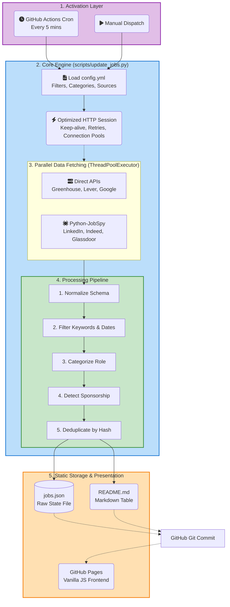

# System Architecture

The New Grad Jobs aggregator avoids traditional full-stack web architectures (e.g., React + Node + PostgreSQL) in favor of a **Static Scraping Architecture**. This ensures the project operates with **$0 hosting costs**, **infinite scale**, and **unbreakable uptime** by leveraging GitHub Actions and GitHub Pages as the entire infrastructure layer.

## Architecture Diagram (Mermaid)

## System Components Explained

### 1. Activation Layer (Infrastructure)
The entire system is orchestrated by GitHub Actions `.github/workflows/update-jobs.yml`.
- **Cron Trigger**: Runs every 5 minutes automatically.
- **Compute**: Uses the standard `ubuntu-latest` runner equipped with Python 3.11+.

### 2. Core Engine (`scripts/update_jobs.py`)
This is the heart of the project. It acts as a monolithic script that avoids the overhead of inter-process communication or microservices.
- **Configuration** (`config.yml`): Dictates which companies to scrape, keywords to exclude, and category mappings. This allows non-engineers to modify behavior without touching Python code.
- **Optimized HTTP Sessions**: Uses a custom `create_optimized_session()` that mounts HTTP adapters with aggressive connection pooling (1000 pools, 300 connections max), HTTP keep-alive, and exponential backoff for rate limits.

### 3. Parallel Data Fetching
To complete the system run within 4-6 minutes, fetching is massively parallelized using Python's `ThreadPoolExecutor` with 50+ concurrent workers.
- **Direct APIs**: Queries unauthenticated JSON endpoints directly for ATS providers (Greenhouse, Lever) and Google Careers.
- **JobSpy**: For difficult targets (LinkedIn, Indeed), the system farms out requests to the `python-jobspy` library to bypass basic scraping protections.

### 4. The Processing Pipeline
Data retrieved from all sources goes through a strict pipeline entirely in-memory:
1. **Schema Normalization**: Converts disparate ATS responses into a unified `Job` object schema.
2. **Filtering**: Drops roles based on text matching (`Sr.`, `Manager`, `2024` if stale, etc.) and date constraints (drops roles posted > 90 days ago).
3. **Categorization**: Uses keyword heuristics to map job titles to buckets like `Software Engineering`, `Data Science`, or `Product Management`.
4. **Sponsorship Detection**: Analyzes the job description text for US Citizenship/Clearance requirements or Visa sponsorship offerings.
5. **Deduplication**: Generates a fast SHA-hash using the company name and standardized job title. If multiple sources (e.g., LinkedIn and Greenhouse) yield the same hash, the duplicate is dropped.

### 5. Static Storage & Presentation
The system's most crucial constraint: **No External Database.**
- **`jobs.json`**: The canonical state of the system. Stored explicitly inside the git repository.
- **`README.md`**: Generates a user-friendly Markdown table for users who simply browse the repository directly on GitHub.
- **GitHub Pages**: The `docs/` directory hosts a Vanilla JS + Vanilla CSS frontend that fetches the raw `jobs.json` from the `main` branch to render a fast, filterable UI for end-users, deployed automatically by GitHub.

## Architectural Trade-offs

* **Pro**: `$0` operating cost.
* **Pro**: Unbreakable Uptime. No database queries to time out when traffic spikes.
* **Con**: "Git Bloat". The repository accumulates a massive amount of automated commits and diff history. We accept this trade-off for the simplicity it provides.
