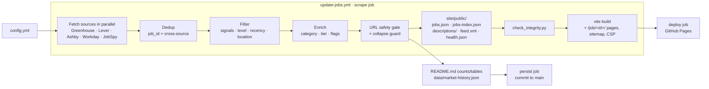

# System Architecture

New Grad Jobs is a static pipeline with no server, no database and no hosting bill. GitHub
Actions scrapes public ATS APIs about every 30 minutes and writes static JSON/RSS. A Vite
build turns that output into the site, and GitHub Pages serves it at
<https://jobs.riteshrana.engineer>. Operational detail is in [operations.md](operations.md),
and the reasoning behind these choices is in the [ADRs](adr/).

```mermaid
flowchart LR
    cfg[config.yml] --> fetch
    subgraph scrape["update-jobs.yml · scrape job"]
        fetch["Fetch sources in parallel<br/>Greenhouse · Lever · Ashby · Workday · JobSpy"] --> dedup[Dedup<br/>job_id + cross-source]
        dedup --> filter[Filter<br/>signals · level · recency · location]
        filter --> enrich[Enrich<br/>category · tier · flags]
        enrich --> gate[URL safety gate<br/>+ collapse guard]
        gate --> out["site/public/<br/>jobs.json · jobs-index.json<br/>descriptions/ · feed.xml · health.json"]
        out --> check[check_integrity.py]
        check --> build["vite build<br/>+ /job/&lt;id&gt;/ pages, sitemap, CSP"]
    end
    build --> deploy[deploy job<br/>GitHub Pages]
    gate --> state[README.md counts/tables<br/>data/market-history.json]
    state --> persist[persist job<br/>commit to main]
```

## Scraper (`scripts/`)

`scripts/update_jobs.py` is a thin entrypoint for the `ngj` package in `scripts/ngj/`:

| Module | Responsibility |
|---|---|
| `settings.py` | Frozen `Settings` built once from `config.yml` and the environment (`NGJ_OUTPUT_DIR`, default `site/public`; `NGJ_SITE_URL`). It is passed explicitly, with no globals. |
| `registry.py` | The single decision on which sources are enabled. It is shared by the pipeline, `health.json` and `validate_config.py`. |
| `sources/*.py` | One adapter per source (Greenhouse, Lever, Ashby, Workday, JobSpy, plus optional Google and GraphQL). Each returns a `SourceResult`. |
| `models.py` | `SourceResult(jobs, errors, raw_count)` and `SourceError(company, source, kind, status, message)`. A failed company is data, not an exception. |
| `http.py` | Shared pooled `requests` session with retries, per-domain concurrency limits and the per-run 403 cooldown (`scripts/source_cooldown.py`). |
| `dedup.py` | Same-posting dedup by `job_id`, then cross-source dedup. |
| `filters.py`, `locations.py`, `dates.py` | The inclusion gate. |
| `taxonomy.py`, `enrich.py`, `compensation.py` | Categories, company tiers, sponsorship/citizenship/closed flags, pay ranges. |
| `outputs/` | `jobs_json`, `rss`, `health`, `market_history`, and `previous` (the last published run). |
| `pipeline.py` | Orchestration: `run()` and `main()`. |

Supporting modules at `scripts/` top level: `contracts.py` (jobs.json schema 1.1,
`canonical_url`, `compute_job_id`), `publish.py` (index + description shards),
`url_safety.py`, `quality.py` / `check_integrity.py`, `sync_readme_counts.py` /
`sync_readme_jobs.py`, and `validate_config.py`.

### Pipeline stages

1. **Fetch:** every enabled source runs concurrently (`ThreadPoolExecutor`), with its
   own worker pool (`worker_pools` in `config.yml`). A crashing adapter becomes an
   `unexpected` error result. It never aborts the run.
2. **Dedup** ([ADR-0004](adr/0004-deduplication-strategy.md)): postings with the same
   `job_id` collapse to the first one. Then jobs from *different* sources that have the
   same normalized company and title and a compatible location are merged. ATS-direct
   postings beat aggregators, and among ATSs the one with more data wins.
3. **Filter** ([ADR-0003](adr/0003-filtering-algorithm.md)): exclusion signals and
   level III+ titles drop first. Then a job needs a new-grad signal and either a strong
   new-grad signal or a track signal. The posting must be no older than
   `filtering.max_age_days`, and the location must be in the US, Canada or India. Every
   signal matches at token boundaries.
4. **Enrich:** category (title first, description only as a fallback), company tier and
   sectors, sponsorship/citizenship flags, closed detection.
5. **Publish:** the URL safety gate drops any non-public link. `generate_jobs_json`
   assigns `first_seen` (carried forward from the previous run). The **partial-collapse
   guard** refuses to write anything if the total falls more than 40% or a large source
   drops to 0 (`NGJ_ALLOW_DROP=1` overrides). Then the history, jobs artifacts, feed and
   health are written, and the README's auto-managed regions are synced. Any write failure
   makes the run exit 1.

### Published artifacts (served at the site root, never committed)

| File | Contents |
|---|---|
| `jobs.json` | Public API: `meta` (`schema_version` 1.1, `generated_at`, `total_jobs`, `categories`) + jobs, newest first. `job_id = "job_" + sha256(source + canonical URL)[:20]`, and `id == job_id`. |
| `jobs-index.json` | Same without `description`, minified. The site loads it on page load. |
| `descriptions/<0-f>.json` | Full "About the role" text, sharded by the first hex digit of `job_id`. |
| `feed.xml` | RSS 2.0, ordered by `first_seen`, guid = `job_id`. |
| `health.json` | Status (`ok`/`degraded`/`failed`), per-source counts and errors, display metrics. Read by the watchdog, the README badges and the collapse guard. |

Persistent state that *is* committed by CI: `README.md` (COUNT markers, "Last updated",
`CATEGORY-LISTINGS` block) and `data/market-history.json` (daily snapshots, 90-day
retention).

## Site (`site/`)

A Vite + React 18 single-page app ([ADR-0005](adr/0005-vite-site-and-actions-deploy.md)).

- `src/data/` fetches `jobs-index.json` (falling back to `jobs.json`), description shards
  and `contributors.json`, all with relative URLs so the build works at any base path.
- `src/lib/` holds the pure, unit-tested logic: `mapJob`, filters, sort, stats, URL view
  state, saved jobs, similar jobs. `taxonomy.js` mirrors `CATEGORY_PATTERNS`.
- `src/components/` contains `shell/` (top bar, footer, sponsor, error boundary),
  `hiring/` (list, filters, detail, dashboard) and `contributors/`.
- `scripts/seo/vite-plugin.mjs` (build only) injects the CSP meta tag and generates
  `job/<job_id>/index.html` for every open job, with `JobPosting` JSON-LD. It also
  generates `sitemap.xml` and `robots.txt`, and prerenders the newest jobs into
  `index.html` for crawlers. Missing data never fails the build.

## Delivery

`update-jobs.yml` is the only deployer. It runs every 30 minutes (`7,37 * * * *`), on
dispatch, and on pushes that touch scraper or site inputs. Its `scrape` job produces the
Pages artifact. Then `deploy` (`actions/deploy-pages`) and `persist` (commits README +
history) run in parallel, on `main` only. `scraper-watchdog.yml` checks the live
`health.json` every 2 hours and re-dispatches the scrape if it is more than 3 hours old.
`ci.yml` (lint, typecheck, test on 3.11/3.13, site), `pre-commit.yml` and `codeql.yml` gate
pull requests.

## Constraints

- **Zero cost, zero servers:** GitHub Actions is the only compute and scheduler, and
  GitHub Pages the only host. No database, no secrets.
- **Honest data:** every number shown on the site or in the README comes from the
  published data. Nothing is estimated or invented.
- **Deterministic, offline tests:** pytest blocks the network, and site logic is pure
  functions under vitest.
